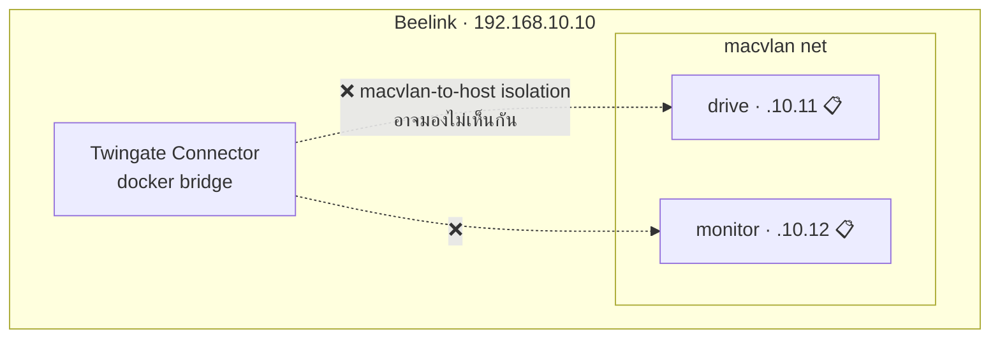

# 🐳 Docker Production Stack — Current Safety Boundary

> [!warning] Current Production Audit required
> Beelink ไม่ใช่เครื่องเปล่า ปัจจุบันมี PostgreSQL, AEGIS Drive, AEGIS Monitor
> และ HUB / NGINX อยู่บนเครื่อง และเคยถูกใช้ทดสอบ persistence,
> backup/restore และ host reboot recovery ตาม [[infrastructure/server/Beelink-Ubuntu-Host]].
> ข้อมูลนี้เป็น deployment context สำหรับ infrastructure validation เท่านั้น
> **ไม่ใช่ข้อสรุปว่า Formal Deployment เสร็จแล้ว**
> กลับไปหน้าศูนย์รวม: [[infrastructure/infrastructure-moc]]

## ⛔ Safety rules before the next phase

- ห้ามสมมติว่า Server เป็นเครื่องเปล่า
- ห้ามใช้ `docker compose down` ในลักษณะที่ทำลาย state
- ห้ามลบ Docker volumes หรือ PostgreSQL databases
- ห้าม deploy/rebuild ใหม่จากศูนย์ก่อน Current Production Audit
- ต้องตรวจ Git commit/source, runtime configuration, containers/images,
  network และ volumes พร้อม checkpoint/rollback ก่อนเปลี่ยนของจริง

เฟสถัดไปคือ **AEGIS Formal Deployment & Web Functional Testing** และต้องจัดทำ
หลักฐานของเฟสนั้นแยกจาก infrastructure readiness

---

## 🧾 Services present during infrastructure validation

| Service | หน้าที่ | โน้ตรายละเอียด | สถานะบน Beelink |
| :--- | :--- | :--- | :--- |
| **gateway** (NGINX) | Reverse Proxy + HUB entry | [[core/hub-aegis-entry]] | ✅ มีอยู่ในการ validation · 🔧 audit topology/config ก่อนแก้ |
| **drive** (IDEA1) | AEGIS Drive workload | [[idea1/idea1-status]] | ✅ มีอยู่ในการ validation · 🔧 formal feature test แยก |
| **monitor** (IDEA2) | AEGIS Monitor workload | [[idea2/idea2-status]] | ✅ มีอยู่ในการ validation · 🔧 formal feature test แยก |
| **postgres** | Application database runtime | [[core/security-architecture]] | ✅ restart/reconnect ผ่าน · 🔧 audit DB/runtime ก่อนเปลี่ยน |
| **storage/volumes** | Persistent runtime state | [[concepts/Three_Layer_Data_Lake]] | ✅ persistence/restore ผ่านในขอบเขต infra · 🔧 inventory ก่อน formal deployment |

> ตารางนี้ไม่รับรอง exact container names, image digests, ports, volume mappings
> หรือ source commit ปัจจุบัน รายละเอียดเหล่านั้นต้องมาจาก Current Production Audit

## ✅ VERIFIED — Runtime restart policy

| Container | Restart policy |
| :--- | :--- |
| `aegis-prod-postgres-1` | `unless-stopped` |
| `aegis-prod-drive-1` | `unless-stopped` |
| `aegis-prod-monitor-1` | `unless-stopped` |
| `aegis-prod-hub-1` | `unless-stopped` |
| `twingate-aegis-connector-02` | `unless-stopped`; `AutoRemove=false` |

## ✅ VERIFIED — Server-side post-reboot health

| Endpoint | Result |
| :--- | :--- |
| `/healthz` | HTTP `200`; `aegis-entry ok:true` |
| `/drive/healthz` | HTTP `200`; `aegis-drive ok:true`; `db=postgres` |
| `/monitor/healthz` | HTTP `200`; `aegis-monitor ok:true`; `db=postgres` |

หลักฐานนี้มาจาก server-side test หลัง reboot ไม่ใช่การอ่านข้อความ JSON
จากภาพ VLAN 30 และยังไม่ใช่ Formal Web Functional Testing

---

## ⚠️ ปัญหาสถาปัตยกรรมที่ต้องตัดสินใจก่อน deploy: Macvlan vs Bridge

**แผนในเล่ม**: ใช้ **Docker Macvlan** ให้ `drive` = `192.168.10.11`, `monitor` = `192.168.10.12` เป็น IP จริงบน VLAN 10

**ปัญหาที่มองเห็นล่วงหน้า**:

* [[infrastructure/remote-access/Twingate-Setup|Twingate Connector]] รันอยู่บน **Docker bridge**
* Linux มีข้อจำกัด **Macvlan-to-Host isolation** — โดยดีฟอลต์ host (และ container บน bridge) **คุยกับ container บน macvlan ไม่ได้** แม้จะอยู่ subnet เดียวกัน
* ⇒ ถ้า deploy ตามเล่มตรง ๆ **Twingate อาจเข้าถึง Drive/Monitor ไม่ได้เลย** ทั้งที่ทุกอย่างดูเหมือนถูกต้อง

### ทางเลือก

| ทางเลือก | วิธีทำ | ข้อดี | ข้อเสีย |
| :--- | :--- | :--- | :--- |
| **ก. Connector → `--network host`** | รัน Twingate ด้วย host networking | เก็บ Macvlan ตามเล่มไว้ได้ | Connector เห็นทุกอย่างบน host = ลด isolation ของตัว Connector เอง |
| **ข. เลิก Macvlan → Bridge + Reverse Proxy** ⭐ | ทุก service อยู่ bridge, เปิดผ่าน `gateway` ตัวเดียว, Twingate ชี้ที่ `192.168.10.10:80/443` | ตรงกับ compose ที่พัฒนามาแล้ว, Resource ใน Twingate เหลือน้อย, จัดการ TLS ที่จุดเดียว | ต้องแก้เล่มเรื่อง IP `.11`/`.12` |
| **ค. Macvlan + สร้าง macvlan shim interface บน host** | เพิ่ม interface พิเศษบน host | เก็บทั้งสองอย่าง | ซับซ้อน ต้องแก้ netplan และอธิบายยากในเล่ม |

> 💡 **ข้อเสนอแนะ**: ทางเลือก **ข** สอดคล้องกับสถาปัตยกรรมที่โค้ดเป็นอยู่จริงมากที่สุด (มี `gateway` NGINX ทำ reverse proxy ให้ `/drive/` และ `/monitor/` อยู่แล้ว ตาม [[core/system-overview]]) — ยังไม่ตัดสินใจ ⏳

---

## 📋 Gate ก่อน AEGIS Formal Deployment & Web Functional Testing

| # | งาน | สถานะ |
| :-- | :--- | :--- |
| 1 | ทำ immutable backup/checkpoint ก่อนแตะ runtime | ⏳ next phase |
| 2 | Inventory Git/source, images, containers, networks, volumes และ PostgreSQL databases | ⏳ next phase |
| 3 | ตรวจ runtime secrets โดยไม่พิมพ์ค่าลง log/vault/repo | ⏳ next phase |
| 4 | Reconcile topology จริงกับ Macvlan/Bridge design เดิม | ⏳ next phase |
| 5 | กำหนด rollout/rollback โดยไม่ลบ state | ⏳ next phase |
| 6 | ทำ Formal Deployment evidence และ Web Functional Testing แยกจาก infra receipt | ⏳ next phase |

---

## 🔍 หมายเหตุสำคัญเรื่องคำว่า "Deployed"

[[core/system-overview]] บันทึกไว้ว่า (2026-07-28) *"`postgres`, `monitor`, `drive`, `gateway` healthy · `http://localhost/monitor/` HTTP 200"*

⚠️ ผลวันที่ 2026-07-28 นั้นยังเป็นผลบนเครื่อง dev และต้องคงไว้เป็น historical evidence
แยกจาก validation บน Beelink วันที่ 2026-08-15 ซึ่งยืนยันว่ามี production workload
และ recovery behavior จริง แต่ยังไม่ใช่ Formal Deployment acceptance

### Windows checkout: Postgres init scripts must remain LF-only

การทดสอบ local Docker เมื่อ 2026-08-07 พบ `502 Bad Gateway` ที่ `/drive/` แม้ image build สำเร็จ เพราะ `postgres/init/01-run-app-init.sh` ถูก checkout เป็น CRLF บน Windows แล้ว Linux อ่าน shebang เป็น `/bin/sh^M`. Postgres init หยุดหลังสร้าง database เปล่า จึงไม่มี schema และไม่มี roles `drive_app` / `monitor_app`; Drive restart ด้วย `Role "drive_app" does not exist` และ NGINX หา upstream ไม่เจอในท้ายที่สุด

แก้ถาวรด้วย `.gitattributes` (`*.sh text eol=lf`) และ `tests/dockerBootstrap.test.mjs` ซึ่งตรวจทั้งไฟล์จริงและกฎ Git. สำหรับ volume ที่ initialization ล้มไปแล้ว **ไม่ต้องลบ volume** ถ้ายังต้องการเก็บข้อมูล: รัน `01-run-app-init.sh` และ `02-app-roles.sh` ภายใน Postgres container แล้ว restart services. รอบที่ซ่อมนี้ยืนยัน `http://localhost/drive/` = HTTP 200, `/drive/healthz` = `ok:true, db:postgres`, และ `drive`/`monitor`/`gateway`/`postgres` healthy.

> `aegis-camera` ยังเป็นปัญหาแยกต่างหากในรอบเดียวกัน: container หาไฟล์ YOLO `best (2).pt` ไม่พบ จึง restart แต่ไม่ใช่ต้นเหตุของ Drive 502.

---

## 🔗 โน้ตที่เกี่ยวข้อง

* [[infrastructure/infrastructure-moc]]
* [[infrastructure/server/Beelink-Ubuntu-Host]] · [[infrastructure/network/VLAN-IP-Plan]]
* [[infrastructure/remote-access/Twingate-Setup]]
* [[core/system-overview]] · [[core/security-architecture]]
* [[90-Status/Document-Conflicts]] · [[90-Status/Open-Items-Backlog]]
