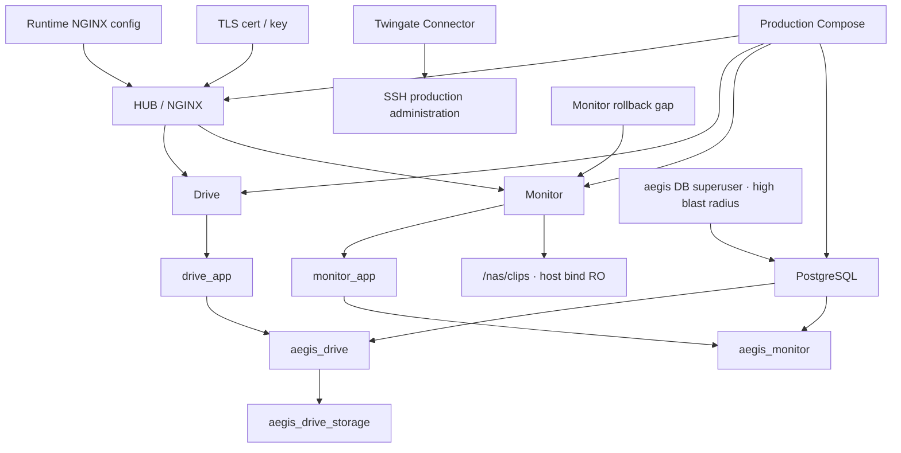
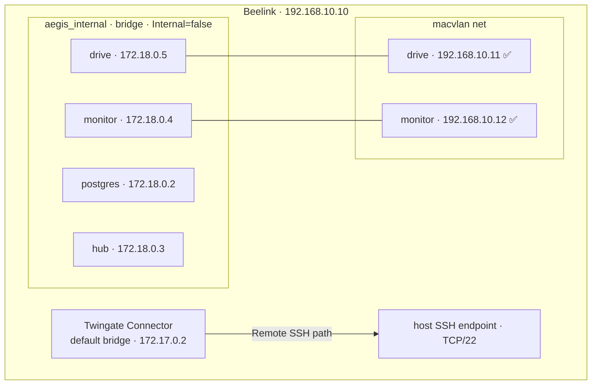

# 🐳 Docker Production Stack — Current Safety Boundary

> [!warning] Current Production Audit required
> Beelink ไม่ใช่เครื่องเปล่า ปัจจุบันมี PostgreSQL, AEGIS Drive, AEGIS Monitor
> และ HUB / NGINX อยู่บนเครื่อง และเคยถูกใช้ทดสอบ persistence,
> backup/restore และ host reboot recovery ตาม [[infrastructure/server/Beelink-Ubuntu-Host]].
> ข้อมูลนี้เป็น deployment context สำหรับ infrastructure validation เท่านั้น
> **ไม่ใช่ข้อสรุปว่า Formal Deployment เสร็จแล้ว**
> กลับไปหน้าศูนย์รวม: [[infrastructure/infrastructure-moc]]

## ⛔ Safety rules before the next phase

- ห้ามสมมติว่า Server เป็นเครื่องเปล่า
- ห้ามใช้ `docker compose down` ในลักษณะที่ทำลาย state
- ห้ามลบ Docker volumes หรือ PostgreSQL databases
- ห้าม deploy/rebuild ใหม่จากศูนย์ก่อน Current Production Audit
- ต้องตรวจ Git commit/source, runtime configuration, containers/images,
  network และ volumes พร้อม checkpoint/rollback ก่อนเปลี่ยนของจริง

เฟสถัดไปคือ **AEGIS Formal Deployment & Web Functional Testing** และต้องจัดทำ
หลักฐานของเฟสนั้นแยกจาก infrastructure readiness

---

## 🧾 Current production services

| Service | หน้าที่ | โน้ตรายละเอียด | สถานะบน Beelink |
| :--- | :--- | :--- | :--- |
| **hub** (NGINX) | Reverse Proxy + HUB entry | [[core/hub-aegis-entry]] | ✅ `aegis-prod-hub-1`; runtime config อยู่นอก Git |
| **drive** (IDEA1) | AEGIS Drive workload | [[idea1/idea1-status]] | ✅ `aegis-prod-drive-1`; persistence `/datalake` |
| **monitor** (IDEA2) | AEGIS Monitor workload | [[idea2/idea2-status]] | ✅ `aegis-prod-monitor-1`; running + healthy แต่มี image rollback/provenance gap |
| **postgres** | Application database runtime | [[core/security-architecture]] | ✅ `aegis-prod-postgres-1`; PostgreSQL 15.19; DB/role/isolation audit PASS |
| **Twingate Connector** | Remote administration path | [[infrastructure/remote-access/Twingate-Setup]] | ✅ `twingate-aegis-connector-02`; default Docker bridge |

## ✅ VERIFIED — Runtime restart policy

| Container | Restart policy |
| :--- | :--- |
| `aegis-prod-postgres-1` | `unless-stopped` |
| `aegis-prod-drive-1` | `unless-stopped` |
| `aegis-prod-monitor-1` | `unless-stopped` |
| `aegis-prod-hub-1` | `unless-stopped` |
| `twingate-aegis-connector-02` | `unless-stopped`; `AutoRemove=false` |

## ✅ VERIFIED — Server-side post-reboot health

| Endpoint | Result |
| :--- | :--- |
| `/healthz` | HTTP `200`; `aegis-entry ok:true` |
| `/drive/healthz` | HTTP `200`; `aegis-drive ok:true`; `db=postgres` |
| `/monitor/healthz` | HTTP `200`; `aegis-monitor ok:true`; `db=postgres` |

หลักฐานนี้มาจาก server-side test หลัง reboot ไม่ใช่การอ่านข้อความ JSON
จากภาพ VLAN 30 และยังไม่ใช่ Formal Web Functional Testing

---

## ✅ Phase B — Formal Current Production Audit

> [!success] Checkpoint state — 2026-08-15
> **Phase A = CLOSED / PASS**
>
> **Phase B audit execution (STEP 1–9) = COMPLETED**
>
> **Formal Production Audit Checkpoint 1 (STEP 1–5) = COMPLETED**
>
> **Documentation Checkpoint 2 = COMPLETED**
>
> **Phase C = NOT STARTED / WAITING FOR HUMAN FINAL REVIEW**
>
> การปิด audit ไม่ได้แปลว่า Formal Deployment หรือ Web Functional Testing เสร็จแล้ว

### STEP 1 — Git / source audit · COMPLETED

| Evidence | Current state |
| :--- | :--- |
| Repository | `/opt/aegis/Project-End-The-AEGIS`; owner `root:root` |
| Branch / tracking | `main` tracking `origin/main` |
| Beelink HEAD / local `origin/main` | `53e347af4626dc548f1b259c00040259939ebe8b` · MATCH |
| Working tree | clean |
| GitHub `main` during audit | `f6adbf01b30f40edba2ce131c5b848662c1e9c6b`; ahead by 6 documentation-only commits |
| Classification | Server source sync **DRIFT — DOCUMENTATION ONLY**; application source drift **NOT OBSERVED** |

ไม่มี `git fetch`, `git pull`, `git reset`, checkout, permission change หรือ global
`safe.directory` change ระหว่าง audit

### STEP 2 — Production Compose vs source · COMPLETED

| Artifact | Evidence / role |
| :--- | :--- |
| Production Compose | `/opt/aegis/runtime/docker-compose.production.yml`; `root:root`; mode `640`; SHA256 `2f2f932b70b7a03fda1d3405890b09dd8502b8d608747aafff62ec5986a0ca03` |
| Compose project / working directory | `aegis-prod` / `/opt/aegis/runtime` |
| Git root Compose | `/opt/aegis/Project-End-The-AEGIS/docker-compose.yml`; SHA256 `d53b38dfa8ab4ec99ca14cda8f462a18bfab9a73777b85e2d90a2be8f74a8281`; dev/test role |
| Git HUB Compose | `HUB-AEGIS_Entry/docker-compose.yml`; SHA256 `3d0d9b3f667175795bd47bc71839bfeb3f8d60c0db3f4477deffbfa31761cc25`; standalone HUB role |
| Classification | **DRIFT — RUNTIME-ONLY CONFIGURATION**, not automatically a production defect |

Production build paths point to the expected Drive, Monitor and HUB component directories
inside the repository. `git pull` alone is therefore **not** a complete production update.

### STEP 3 — Image / build provenance · COMPLETED

| Service | Runtime evidence | Classification |
| :--- | :--- | :--- |
| Drive | image `sha256:e01510eb45bab01b34e07068dd199bc165d66e408ca4b08a750f96aa4a47c90b`; source latest commit `79ded7ea24286579965962896018ec726c59b966` | MATCH — MODERATE PROVENANCE; no OCI Git revision label |
| HUB | image `sha256:3095929132a4a83c0e8114179fbdfc7793e8203f038eab9da51817181b7f8eac` | MATCH — MODERATE PROVENANCE |
| PostgreSQL | `postgres:15-alpine`; runtime image `sha256:4006528dcbdd9be8c1aaa50389caea4e93c46d6f54c3533bcd3253725e526e23` | MATCH — upstream image identified; mutable tag review deferred |
| Monitor | running image `sha256:df2a0e865ebcc5c98b25b24e5df93ebf6b71822539947fe16bb0e4bbd91a4df6`; local `aegis-prod-monitor:latest` = `sha256:ef686b939db3afcc1ff46e1ad9e27bca3fbeec89dd54c2435b2c4e581e083285` | Runtime healthy; **DRIFT — IMAGE / ROLLBACK GAP** |

> [!danger] Monitor safety boundary
> Monitor ไม่ได้เสีย: container ยัง `running` และ `healthy`. Finding คือ running image
> ไม่ตรง current local `latest` และ running image object resolve จาก local store ไม่ได้แล้ว
> จึง **ห้าม recreate/rebuild** จนกว่าจะมี rollback plan ใน Phase D

### STEP 4 — Docker network / Macvlan · COMPLETED

| Network | Verified runtime |
| :--- | :--- |
| `aegis_internal` | bridge `172.18.0.0/16`; gateway `172.18.0.1`; Docker `Internal=false` |
| Current bridge IPs | PostgreSQL `.2`; HUB `.3`; Monitor `.4`; Drive `.5` — runtime-only, **DO NOT HARD-CODE** |
| `aegis_vlan10_macvlan` | macvlan `192.168.10.0/24`; gateway `192.168.10.1`; parent `enp1s0` |
| Production service IPs | Drive `192.168.10.11`; Monitor `192.168.10.12` — MATCH |
| Twingate Connector | default bridge `172.17.0.2`; subnet `172.17.0.0/16`; gateway `172.17.0.1` |

ชื่อ `aegis_internal` ไม่ได้ทำให้ network เป็น Docker internal-only; ค่า `Internal=false`
เป็น security/design observation สำหรับ change-planning ภายหลัง ห้ามเปลี่ยนใน Phase B

### STEP 5 — Volumes / bind mounts / persistence · COMPLETED

| Workload | Verified mapping | Classification |
| :--- | :--- | :--- |
| PostgreSQL | `aegis_postgres_data` → `/var/lib/postgresql/data`, RW; host mountpoint `/var/lib/docker/volumes/aegis_postgres_data/_data` | MATCH · DO NOT TOUCH |
| Drive | `aegis_drive_storage` → `/datalake`, RW; host mountpoint `/var/lib/docker/volumes/aegis_drive_storage/_data` | MATCH · DO NOT TOUCH |
| Monitor clips | host `/opt/aegis/data/monitor-clips` → `/nas/clips`, RO | MATCH; host path is deployment concern |
| HUB NGINX | `/opt/aegis/runtime/nginx/nginx.production.conf` → `/etc/nginx/conf.d/default.conf`, RO | MATCH · RUNTIME-ONLY |
| HUB TLS certs | `/opt/aegis/runtime/certs` → `/etc/nginx/certs`, RO | MATCH · RUNTIME-ONLY · SENSITIVE |
| PostgreSQL runtime init | `/opt/aegis/runtime/postgres/01-run-app-schema.sh` mounted with repo schema/init files, RO | MATCH; checksum baseline deferred to STEP 8 |

Anonymous local volume `7135d9126630654dad1716b6e099534666f906a71fe2a4c0e83ff75f2e262389`
ถูกพบว่าไม่ attached และไม่ทราบ owner/purpose: **DRIFT / OWNERSHIP UNKNOWN / DO NOT DELETE**.

### STEP 6 — PostgreSQL formal audit · COMPLETED / PASS

PostgreSQL `15.19` มี `aegis_drive` และ `aegis_monitor` ตามที่คาด และพบ
`aegis_db` กับ `postgres` เพิ่มเติมโดยไม่ลบหรือ rename. Login roles มี `aegis`,
`drive_app`, `monitor_app`; ไม่พบ unexpected login role.

| Control | Verified state |
| :--- | :--- |
| Application DB isolation | `drive_app` เชื่อม `aegis_drive` ได้และเชื่อม `aegis_monitor` ไม่ได้; `monitor_app` เป็นทางกลับกัน |
| `PUBLIC CONNECT` | revoked บนสอง application DB; ยังมีบน `aegis_db`/`postgres` เป็น observation |
| Schema | app roles มี `USAGE`, ไม่มี `CREATE` |
| Drive tables | 8 tables; `drive_app` มี DML 8/8; `monitor_app` 0/8 |
| Monitor tables | 7 tables; `monitor_app` มี DML 7/7; `drive_app` 0/7 |
| Sequences/default ACL | scoped role ได้ `USAGE`/`SELECT`; default ACL ตรง application boundary |
| Credential state | ทุก login role มี SCRAM-SHA-256 verifier; runtime app passwords SET/NON-DEFAULT; ไม่บันทึกค่า |
| Endpoint identity | Drive = `drive_app@postgres:5432/aegis_drive`; Monitor = `monitor_app@postgres:5432/aegis_monitor` |

Open observations ไม่ใช่ Phase B blocker: `aegis` เป็น superuser/CREATEROLE/CREATEDB/
REPLICATION/BYPASSRLS จึงมี high blast radius; `PUBLIC TEMPORARY` ยังมี;
`drive_app` มี UPDATE/DELETE บน `audit_log`; credentials ไม่มี expiry.

### STEP 7 — Application account / RBAC audit · COMPLETED / PASS

| Application | Production account evidence | Classification |
| :--- | :--- | :--- |
| Drive | `admin` · role `Admin` · display `System Administrator` · `must_reset_password=true`; ไม่มี active/enabled column | MATCH; first-login reset pending |
| Drive | expected `user` / `DataLake-User` ไม่พบ | Web-test readiness gap; ไม่ใช่ runtime defect |
| Monitor | `soc` · role `SOC-Responder` · active=true · `must_reset_password=true` | MATCH; reset gate enforced |
| Monitor | expected `operator`/`operator2` ไม่พบ | Web-test readiness gap |
| Monitor fixtures | cameras=0, assignments=0, SOC assigned_camera_count=0 | camera-scoped CCTV Operator proof PENDING |

RBAC constraints ตรง source (`Admin`/`DataLake-User`, `SOC-Responder`/
`CCTV-Operator`). ห้าม reset password, seed demo data หรือสร้าง account ใน audit นี้.

### STEP 8 — Runtime configuration integrity · COMPLETED / PASS

| Artifact | Integrity baseline |
| :--- | :--- |
| Production Compose | `2f2f932b70b7a03fda1d3405890b09dd8502b8d608747aafff62ec5986a0ca03` |
| Active NGINX config | `fc36531670329415c11091172a5bb6d3704e2070d8fab419948b8aa27b44c306` |
| Historical NGINX config | `711f006f204698fc61a9e45183b497c7aa8ae4d6b9e2c55b7295faadd015d9c4` · rollback candidate · DO NOT DELETE |
| Runtime PostgreSQL script | `1ac7506ac1d6e991c791b09bfa63dd06dc106017afc1450ceb147fde8a67f7ec` |
| TLS certificate | `b40d21e1dfdef1691adb5a40fc810093909dcb79f4e75489a3f968cd03b83df1` |
| `.env` | `/opt/aegis/Project-End-The-AEGIS/.env`; `root:root`, mode `600`, metadata only |
| TLS private key | `/opt/aegis/runtime/certs/aegis.key`; `root:root`, mode `600`, metadata only |

TLS certificate/private-key public keys MATCH; certificate เป็น self-signed/internal
(`CN=192.168.10.10`, valid 2026-08-13 ถึง 2028-11-15). Backup สอง generation
อยู่ใน `/opt/aegis/backups`, owner `root:root`, mode `600`; Phase A เคยผ่าน SHA256,
true restore และ Windows off-host copy. ไม่พบ AEGIS-specific systemd service หรือ cron.

### STEP 9 — SSH / Twingate audit · COMPLETED / PASS

OpenSSH ใช้ TCP/22, `PermitRootLogin no`, `PubkeyAuthentication yes`,
`PasswordAuthentication no`, `KbdInteractiveAuthentication no` และ socket activation:
`ssh.service` disabled/active กับ `ssh.socket` enabled/active เป็นสถานะที่ถูกต้อง.
การตรวจ `authorized_keys` ด้วย non-root shell เคยให้ false negative เพราะ home mode `750`;
sudo-based check ยืนยันไฟล์ของ `pubpup2006p` และ `krayukantk` มีอยู่จริง.

ทั้ง `pubpup2006p` และ `krayukantk` ยืนยัน `whoami`, hostname `aegis-system`,
SSH source `172.17.0.2` และ functional sudo elevation เป็น root ผ่าน Twingate.
Connector `aegis-connector-02` ตรงกับ container `twingate-aegis-connector-02`:
running/healthy, `unless-stopped`, version `1.90.0` up to date, Controller/Relay connected,
Time Offset `0s`, STUN available, hostname ตรง container ID prefix และ private IP `172.17.0.2`.
Token values ไม่ถูกเปิดเผย; creation/rotation timestamp = **NOT EXPOSED / NOT VERIFIED**.

---

## Production source-of-truth matrix

| Concern | Authoritative source |
| :--- | :--- |
| Approved application source | canonical GitHub repository; deployment commit ต้อง freeze แยกใน Phase C |
| Current server checkout | Beelink checkout `/opt/aegis/Project-End-The-AEGIS` ณ audited commit |
| Production orchestration | `/opt/aegis/runtime/docker-compose.production.yml` |
| Production secret/config | protected `.env`; **DO NOT DISPLAY** |
| Executing application | immutable Docker Image ID ของแต่ละ running container |
| Database truth | runtime PostgreSQL catalogs/ACLs + `aegis_postgres_data` |
| Drive bytes | `aegis_drive_storage` mounted `/datalake` |
| Monitor clips | `/nas/clips` backed by `/opt/aegis/data/monitor-clips` |
| Docker topology | runtime `docker network inspect` evidence |
| VLAN/network | MikroTik/switch/host runtime evidence |
| Remote access | Twingate Admin Console + Docker runtime + functional SSH |
| Documentation | Obsidian Project Knowledge |

เมื่อ stale documentation ขัดกับ verified runtime evidence ให้ runtime evidence ชนะ
จนกว่าเอกสารจะถูกแก้ โดยไม่ถือว่า runtime-only artifact เป็น defect โดยอัตโนมัติ.

## Production Service Contract v2

| Service | Developer-facing contract |
| :--- | :--- |
| HUB | `192.168.10.10:80/443`; entry/reverse proxy; self-signed internal TLS |
| Drive | service `drive`; `192.168.10.11:8001`; DB `aegis_drive` role `drive_app`; `/datalake` → `aegis_drive_storage` |
| Monitor | service `monitor`; `192.168.10.12:8002`; DB `aegis_monitor` role `monitor_app`; `/nas/clips` → host bind RO |
| PostgreSQL | service `postgres`; internal `5432`; application DBs/roles แยก; ไม่ publish เป็น production host service |
| Twingate | connector `aegis-connector-02`; container `twingate-aegis-connector-02`; bridge IP `172.17.0.2` เป็น runtime detail |

Dynamic `172.17/172.18.x` addresses ห้าม hard-code ใน application source.

## Data Preservation Map

| Critical item | Purpose / dependency | Safe operations | Unsafe operations |
| :--- | :--- | :--- | :--- |
| `aegis_postgres_data` | production DB persistence | inspect/backup/checksum ตาม approved runbook | down `-v`, delete, reinitialize, wipe DB |
| `aegis_drive_storage` | Drive production bytes | read-only inventory/backup | delete/prune/overwrite |
| `/opt/aegis/data/monitor-clips` | Monitor clip source, mounted RO | read-only validation | delete/replace without ownership plan |
| `/opt/aegis/backups` | restore checkpoints | verify hashes/copies | delete existing generations |
| production `.env` | runtime secrets/config | metadata-only audit | display, overwrite, commit |
| TLS private key | HTTPS identity | permission/metadata audit | expose or casually replace |
| Monitor running container/image | only healthy runnable state currently proven | inspect only | recreate/rebuild before rollback plan |
| unknown anonymous volume | ownership unknown | read-only provenance investigation | delete or `docker volume prune` |

## Dependency / blast-radius map

เปลี่ยน Production Compose กระทบทุก application workload; NGINX/TLS กระทบ entry path;
DB superuser กระทบทั้ง cluster; Twingate/SSH กระทบ remote administration;
Monitor recreation มีความเสี่ยงสูงเพราะ rollback artifact gap.

## Final classification

| Area | Final Phase B classification |
| :--- | :--- |
| Git source sync | DRIFT — observed delta documentation-only |
| Production Compose | MATCH — runtime-only source of truth |
| Drive / HUB images | MATCH |
| PostgreSQL image | MATCH + mutable-tag observation |
| Monitor runtime / rollback artifact | HEALTHY-MATCH / DRIFT — DO NOT RECREATE |
| Docker Macvlan / bridge | MATCH / MATCH + `Internal=false` observation |
| PostgreSQL service/data isolation | PASS |
| DB credentials | PASS — SCRAM, known dev defaults not used |
| `aegis` DB role | HIGH BLAST RADIUS — not an app role |
| Drive `admin` / `user` | MATCH + reset pending / TEST-READINESS GAP |
| Monitor `soc` / operators | MATCH + reset pending / TEST-READINESS GAP |
| Monitor cameras | `0` — scoped RBAC functional test pending |
| Runtime config | BASELINED |
| TLS | CRYPTOGRAPHIC MATCH / SELF-SIGNED TRUST MODEL |
| Backups | PRESENT / PROTECTED |
| SSH / Twingate | PASS / PASS |
| Unknown volume | DO NOT DELETE |

## Phase C gate — Web Functional Test readiness

Phase C ยัง **NOT STARTED**. ก่อนเริ่มต้องให้มนุษย์อนุมัติเอกสาร Phase B,
ทำ Source Freeze/Source-Runtime Alignment แยก, วาง Monitor rollback plan,
อนุมัติวิธี provision `DataLake-User` และ `CCTV-Operator`, เตรียม camera/test data
แบบควบคุม, รักษา first-login reset ของ `admin`/`soc`, และทดสอบ self-signed TLS
โดยไม่ seed demo data หรือเปลี่ยน DB/account state โดยพลการ.

---

## ⚠️ Network isolation observation for later change planning

Runtime audit ยืนยันแล้วว่า Drive/Monitor ใช้ทั้ง `aegis_internal` bridge และ
`aegis_vlan10_macvlan` โดยมี `.11/.12` จริง ส่วน Twingate Connector อยู่ default bridge.
สถานะ production ปัจจุบันทำงานอยู่ จึงไม่ใช้ข้อกังวลเชิง design เดิมสรุปว่า path เสีย
แต่ต้องทบทวน `Internal=false`, outbound dependency และ blast radius ก่อนแก้ topology

### ทางเลือก

| ทางเลือก | วิธีทำ | ข้อดี | ข้อเสีย |
| :--- | :--- | :--- | :--- |
| **ก. Connector → `--network host`** | รัน Twingate ด้วย host networking | เก็บ Macvlan ตามเล่มไว้ได้ | Connector เห็นทุกอย่างบน host = ลด isolation ของตัว Connector เอง |
| **ข. เลิก Macvlan → Bridge + Reverse Proxy** ⭐ | ทุก service อยู่ bridge, เปิดผ่าน `gateway` ตัวเดียว, Twingate ชี้ที่ `192.168.10.10:80/443` | ตรงกับ compose ที่พัฒนามาแล้ว, Resource ใน Twingate เหลือน้อย, จัดการ TLS ที่จุดเดียว | ต้องแก้เล่มเรื่อง IP `.11`/`.12` |
| **ค. Macvlan + สร้าง macvlan shim interface บน host** | เพิ่ม interface พิเศษบน host | เก็บทั้งสองอย่าง | ซับซ้อน ต้องแก้ netplan และอธิบายยากในเล่ม |

> [!warning] No production change in Phase B
> ทางเลือกเก่าเป็น historical design analysis เท่านั้น Checkpoint 1 ไม่เลือกวิธีใหม่
> ไม่ connect/disconnect network และไม่เปลี่ยน Macvlan/bridge configuration

---

## 📋 Formal Current Production Audit gate

| # | งาน | สถานะ |
| :-- | :--- | :--- |
| 1 | Git / Source Audit | ✅ COMPLETED |
| 2 | Production Compose vs Source | ✅ COMPLETED |
| 3 | Container Image / Build Provenance | ✅ COMPLETED |
| 4 | Docker Network / Macvlan Audit | ✅ COMPLETED |
| 5 | Volumes / Bind Mounts / Persistence | ✅ COMPLETED |
| 6 | PostgreSQL Audit | ✅ COMPLETED / PASS |
| 7 | Application Account / RBAC Audit | ✅ COMPLETED / PASS; test-identity fixtures remain pending |
| 8 | Runtime Files Outside Repository | ✅ COMPLETED / BASELINED |
| 9 | SSH + Twingate side checks | ✅ COMPLETED / PASS |

Final source-of-truth matrix, service contract, dependency/blast-radius map,
data-preservation map และ runtime integrity baseline ถูกจัดทำใน Checkpoint 2 แล้ว.
ขั้นต่อไปคือ human final review; ห้ามเริ่ม Phase C อัตโนมัติ.

### Checkpoint 1 safety record

STEP 1–5 เป็น controlled read-only audit: ไม่มี deploy/rebuild/restart, Git mutation,
Compose/`.env` change, Docker network/volume change, database/account change หรือ
VLAN/UFW/Twingate/SSH change

### Checkpoint 2 safety record

STEP 6–9 และ final Phase B documentation เป็น documentation-only reconciliation:
ไม่มี source/runtime/config change, Git mutation, container restart/rebuild,
database/account/RBAC write, network/UFW/SSH/Twingate change หรือ secret disclosure.

---

## 🔍 หมายเหตุสำคัญเรื่องคำว่า "Deployed"

[[core/system-overview]] บันทึกไว้ว่า (2026-07-28) *"`postgres`, `monitor`, `drive`, `gateway` healthy · `http://localhost/monitor/` HTTP 200"*

⚠️ ผลวันที่ 2026-07-28 นั้นยังเป็นผลบนเครื่อง dev และต้องคงไว้เป็น historical evidence
แยกจาก validation บน Beelink วันที่ 2026-08-15 ซึ่งยืนยันว่ามี production workload
และ recovery behavior จริง แต่ยังไม่ใช่ Formal Deployment acceptance

### Windows checkout: Postgres init scripts must remain LF-only

การทดสอบ local Docker เมื่อ 2026-08-07 พบ `502 Bad Gateway` ที่ `/drive/` แม้ image build สำเร็จ เพราะ `postgres/init/01-run-app-init.sh` ถูก checkout เป็น CRLF บน Windows แล้ว Linux อ่าน shebang เป็น `/bin/sh^M`. Postgres init หยุดหลังสร้าง database เปล่า จึงไม่มี schema และไม่มี roles `drive_app` / `monitor_app`; Drive restart ด้วย `Role "drive_app" does not exist` และ NGINX หา upstream ไม่เจอในท้ายที่สุด

แก้ถาวรด้วย `.gitattributes` (`*.sh text eol=lf`) และ `tests/dockerBootstrap.test.mjs` ซึ่งตรวจทั้งไฟล์จริงและกฎ Git. สำหรับ volume ที่ initialization ล้มไปแล้ว **ไม่ต้องลบ volume** ถ้ายังต้องการเก็บข้อมูล: รัน `01-run-app-init.sh` และ `02-app-roles.sh` ภายใน Postgres container แล้ว restart services. รอบที่ซ่อมนี้ยืนยัน `http://localhost/drive/` = HTTP 200, `/drive/healthz` = `ok:true, db:postgres`, และ `drive`/`monitor`/`gateway`/`postgres` healthy.

> `aegis-camera` ยังเป็นปัญหาแยกต่างหากในรอบเดียวกัน: container หาไฟล์ YOLO `best (2).pt` ไม่พบ จึง restart แต่ไม่ใช่ต้นเหตุของ Drive 502.

---

## 🔗 โน้ตที่เกี่ยวข้อง

* [[infrastructure/infrastructure-moc]]
* [[infrastructure/server/Beelink-Ubuntu-Host]] · [[infrastructure/network/VLAN-IP-Plan]]
* [[infrastructure/remote-access/Twingate-Setup]]
* [[core/system-overview]] · [[core/security-architecture]]
* [[90-Status/Document-Conflicts]] · [[90-Status/Open-Items-Backlog]]
