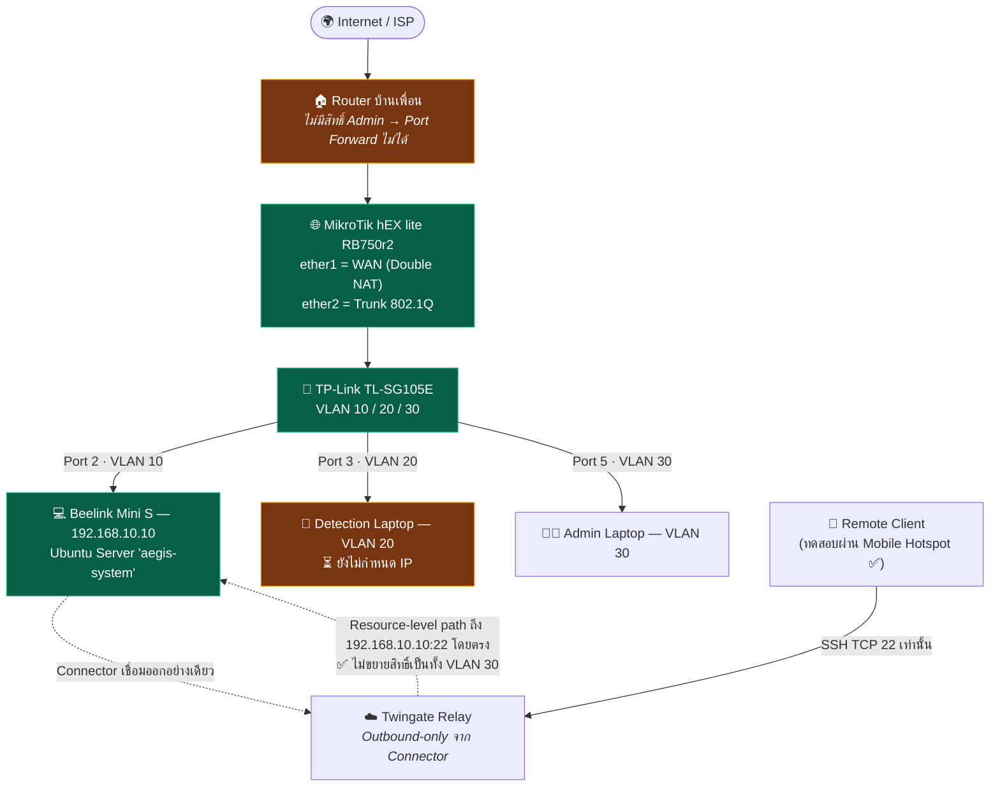

# 🗺️ AEGIS Infrastructure — Map of Content

> [!info] Ownership
> Owner: **Kla**. Infrastructure is a shared runtime dependency but has one canonical writer; IDEA owners submit integration requests through their task receipts.

> ศูนย์รวมลิงก์และสถานะจริงของงาน **Infrastructure / Network / Remote Access** ของโปรเจกต์ AEGIS
> ณ วันที่ **15 สิงหาคม 2026**
>
> โน้ตชุดนี้บันทึก **สิ่งที่ทำจริงบนฮาร์ดแวร์** แยกจากชุดโน้ตเดิม (`concepts/`, `entities/`) ที่บันทึก **สิ่งที่ออกแบบไว้ในเล่มรายงาน**
> เมื่อสองฝั่งไม่ตรงกัน ให้ยึดโน้ตชุดนี้เป็นความจริง และดูรายการที่ขัดกันได้ที่ [[90-Status/Document-Conflicts]]

## Start here

Start with the current operating-state table below, then open the authoritative network, server, remote-access, or deployment note for the change at hand. This MOC records what is real on the infrastructure, not merely what the report designed.

## Owned source and canonical notes

Owner: **Kla**. Infrastructure-owned paths include the runtime, gateway, database, deployment, and network surfaces. The canonical notes are the linked `infrastructure/` network, server, remote-access, and deployment records.

## Current state and open work

### 🚦 ความหมายของ Status Marker

| Marker | ความหมาย |
| :--- | :--- |
| ✅ | ทำจริงแล้ว **และมีหลักฐานการทดสอบ** |
| 🔧 | ทำแล้ว แต่ **ยังไม่ทดสอบ / ทดสอบไม่ครบทุกเคส** |
| ⏳ | ยังไม่ได้ทำ |
| 📋 | เป็นแค่ Design ในเล่มรายงาน ยังไม่แตะของจริง |

> ⚠️ **กติกาเหล็ก**: ห้ามเลื่อน 🔧 → ✅ ถ้าไม่มีบรรทัดหลักฐานทดสอบกำกับ

---

### 📌 บริบทโปรเจกต์

* **ชื่อเต็ม**: AEGIS — Autonomous Edge-Guard Infrastructure System for Cyber-Physical Security
* **รายวิชา**: 1101911 มหาวิทยาลัยเทคโนโลยีสุรนารี
* **อาจารย์ที่ปรึกษา**: ผศ. ดร.ทรงยุทธ เพิ่มผล
* **ทีม 3 คน**: กล้า (B6703370 — infra/network/security), มิวสิค (B6701635), ปั๊บ (B6702861) → [[entities/Team_Roles_and_Responsibilities]]
* **3 IDEA**:
  * IDEA1 **AEGIS Drive** — Edge Data Lake / NAS → [[idea1/idea1-status]]
  * IDEA2 **AEGIS Monitor** — AI CCTV → [[idea2/idea2-status]]
  * IDEA3 **Cyber-Physical Lockdown** — ESP32 + Relay + MQTT → [[idea3/idea3-status]]

---

### 🧭 สถานะภาพรวม (Infrastructure Layer)

| ชั้นงาน | สถานะ | โน้ตหลัก |
| :--- | :--- | :--- |
| สถาปัตยกรรมเครือข่าย & Defense in Depth | ✅ | [[infrastructure/network/VLAN-IP-Plan]] |
| ฮาร์ดแวร์ครบตามแผน (ยกเว้น IDEA3) | ✅ / ⏳ ESP32 | [[infrastructure/network/Hardware-Inventory]] |
| Edge Router (MikroTik) + Inter-VLAN Routing | ✅ (⏳ ยังไม่ backup config) | [[infrastructure/network/MikroTik-Config]] |
| Managed Switch VLAN + PVID | ✅ | [[infrastructure/network/Switch-VLAN-Config]] |
| Ubuntu Server Host พร้อมใช้งาน | ✅ | [[infrastructure/server/Beelink-Ubuntu-Host]] |
| บัญชีผู้ใช้รายบุคคล | ✅ per-account SSH + functional sudo evidence · 🔧 least-privilege/docker policy audit | [[infrastructure/server/Linux-User-Accounts]] |
| SSH Key Authentication | ✅ `PasswordAuthentication no` · `PermitRootLogin no` · `ssh.socket` recovered หลัง reboot | [[infrastructure/server/SSH-Hardening-Status]] |
| Remote Access ผ่าน Twingate ZTNA | ✅ Remote SSH + AEGIS Web + `aegis.internal` + Private CA trust + X1 Windows endpoint onboarding verified | [[infrastructure/remote-access/Twingate-Setup]] |
| OpenVPN | ❌ **เลิกใช้ (Deprecated)** | [[infrastructure/remote-access/OpenVPN-Deprecated]] |
| UFW production state | ✅ active; deny incoming/routed, allow outgoing; SSH allow จาก Docker/Twingate และ VLAN 30 | [[infrastructure/server/Beelink-Ubuntu-Host]] |
| VLAN 30 management path | ✅ on-site client `192.168.30.99` ถึง gateway และ Beelink `4/4`, `0%` loss | [[infrastructure/network/VLAN-IP-Plan]] |
| Server / Infrastructure Production Readiness | ✅ **CLOSED / PASS** | [[infrastructure/server/Beelink-Ubuntu-Host]] |
| Production workload context | ✅ restart policy `unless-stopped` และ server-side post-reboot health HTTP 200 ผ่าน | [[infrastructure/deployment/Docker-Stack-Plan]] |
| Phase B Formal Current Production Audit | ✅ STEP 1–9 + Checkpoint 2 documentation COMPLETED · Phase C NOT STARTED | [[infrastructure/deployment/Docker-Stack-Plan]] |
| IDEA3 MQTT / ESP32 / Relay | ⏳ เขียนแล้วยังไม่ทดสอบ | [[idea3/idea3-status]] |

> 📋 **สรุปงาน 15 ขั้นตอนแบบละเอียดพร้อมหลักฐานการทดสอบ** อยู่ที่ [[90-Status/Progress-Log-2026-08-06]]
>
> ✅ **Infrastructure readiness ปัจจุบัน**: SSH hardening, VLAN 30 on-site path,
> backup/true restore, service persistence และ controlled host reboot ผ่านแล้ว
> ดูผลและขอบเขตหลักฐานที่ [[infrastructure/server/Beelink-Ubuntu-Host]].
>
> ✅ **Production audit ปัจจุบัน**: STEP 1–9 และ Documentation Checkpoint 2
> เสร็จแบบ read-only แล้ว ครอบคลุม Git/Compose/image/network/persistence,
> PostgreSQL/RBAC, runtime integrity และ SSH/Twingate. Monitor ยัง healthy
> แต่มี rollback gap; Phase C ยังไม่เริ่มและรอ human final review.
>
> ⚠️ **Open evidence:** Twingate token creation/rotation timestamp ไม่แสดงและ
> ไม่ยืนยัน แต่ Connector ปัจจุบัน healthy/connected และไม่ต้อง rotate.
> Functional SSH + sudo ของ `pubpup2006p`/`krayukantk` ผ่านแล้ว;
> least-privilege policy enumeration และ `docker` membership ยังรอตรวจ
> ตาม [[90-Status/Open-Items-Backlog]].

---

### 🗂️ สารบัญโน้ต

### 10-Network
* [[infrastructure/network/Hardware-Inventory]] — รายการอุปกรณ์จริงและสเปก
* [[infrastructure/network/VLAN-IP-Plan]] — ผัง VLAN / Subnet / IP ทุกตัว
* [[infrastructure/network/MikroTik-Config]] — Edge Router, VLAN Interface, Firewall order
* [[infrastructure/network/Switch-VLAN-Config]] — Port mapping / PVID บน TL-SG105E

### 20-Server
* [[infrastructure/server/Beelink-Ubuntu-Host]] — Ubuntu Server host `aegis-system`
* [[infrastructure/server/Linux-User-Accounts]] — บัญชีรายบุคคลและสิทธิ์
* [[infrastructure/server/SSH-Hardening-Status]] — สถานะ SSH Key + Checklist ก่อนปิด Password Login

### 30-RemoteAccess
* [[infrastructure/remote-access/Twingate-Setup]] — ZTNA Connector / Resource / Policy
* [[infrastructure/remote-access/OpenVPN-Deprecated]] — เหตุผลที่เลิกใช้และสิ่งที่ต้องระวังตอนเขียนเล่ม

### 40-Deployment
* [[infrastructure/deployment/Docker-Stack-Plan]] — แผน deploy Gateway/Drive/Monitor/PostgreSQL

### 90-Status
* [[90-Status/Progress-Log-2026-08-06]] — สรุปงาน 15 ขั้นตอนที่ทำไปแล้ว
* [[90-Status/Open-Items-Backlog]] — คิวงานถัดไปเรียงตาม P1/P2/P3
* [[90-Status/Document-Conflicts]] — จุดที่เอกสาร/เล่มรายงานขัดกับของจริง

---

## Shared dependencies

Infrastructure is the shared runtime dependency for every area. Coordinate cross-area gateway, database, identity, network, and deployment changes through [[core/integration-points]] and [[core/security-architecture]].

### 🖼️ ภาพรวมเส้นทางเครือข่ายจริง



> เส้นประจาก Twingate ไปยัง Beelink คือ remote resource path ที่ใช้งานจริงและแคบกว่า `/24`.
> VLAN 30 เป็น on-site direct-management path แยกต่างหากและผ่าน validation ล่าสุดแล้ว
> ตาม [[infrastructure/network/VLAN-IP-Plan]].

---

### 🔗 เชื่อมกับโน้ตชุดเดิมในวอลต์

* [[core/system-overview]] — สถาปัตยกรรมซอฟต์แวร์ (Monorepo/Docker)
* [[concepts/VLAN_Segmentation_and_Port_Mapping]] — ผัง VLAN ฉบับออกแบบในเล่ม
* [[concepts/ZTNA_Twingate_vs_OpenVPN]] — การเปรียบเทียบฉบับออกแบบ (⚠️ ยังเขียนแบบ 2 ช่องทางคู่ขนาน)
* [[core/security-architecture]] — Defense in Depth ระดับแอปพลิเคชัน

## Recent task receipts — infrastructure-related receipt discovery

Kla also owns IDEA1, so this query is a discovery aid rather than a complete infrastructure-only filter. Confirm the changed paths in each receipt.

```query
path:"90-Status/logs" [owner:kla]
```

## Finish an area task

Record verified evidence and remaining limitations in the canonical infrastructure note, add one immutable receipt, and request integration review for every shared runtime or contract change.
