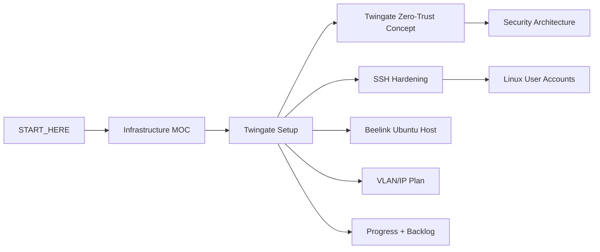

# Twingate Knowledge Consolidation Design

**Date:** 2026-08-07
**Scope:** `Obsidian_AEGIS_Vault/AEGIS_Knowledge`
**Decision:** Twingate is the only active remote-access architecture. OpenVPN is removed from the active knowledge graph.

## Goal

Turn the Twingate work recorded in the referenced conversation into one coherent, evidence-based knowledge path that clearly separates verified state, operating procedure, security boundaries, troubleshooting lessons, and unfinished work. Remove OpenVPN notes and active links so readers cannot mistake a discarded design for a deployed capability.

## Source-of-truth rules

1. The verified hardware/deployment notes under `10-Network`, `20-Server`, `30-RemoteAccess`, and `90-Status` override older design-only claims.
2. A claim is marked complete only when the conversation contains a concrete test result or the existing vault records equivalent evidence.
3. The following are verified: Beelink `192.168.10.10`; Twingate Remote Network `aegissut`; one Docker bridge Connector on Beelink reporting Online/Healthy; Resource `AEGIS-Beelink-SSH`; TCP 22 only with UDP/ICMP blocked; Admin group access; external Mobile Hotspot test; Windows `InterfaceAlias: Twingate`; `TcpTestSucceeded: True`; successful SSH into `admin-main@aegis-system`.
4. The following remain unfinished: connector token rotation after exposure, group review, restart/recovery verification, SSH keys generated on each owner's own laptop, removal of duplicate/contaminated keys, disabling password authentication, confirming `PermitRootLogin no`, and sudo-scope review.
5. Connector experiments using host networking are troubleshooting history, not the deployed architecture. The final verified Connector uses Docker bridge networking.
6. Secrets, real tokens, passwords, private keys, and Telegram identifiers must never be copied into the vault.

## Information architecture

### Primary navigation

`START_HERE` and `index` link to `00-MOC/AEGIS-Infrastructure-MOC`, which becomes the infrastructure entry point. Its remote-access branch points only to `30-RemoteAccess/Twingate-Setup`.

### Ownership boundaries

- `30-RemoteAccess/Twingate-Setup.md`: deployed topology, access flow, verified evidence, normal operation, Connector lifecycle, failure recovery, and Twingate-specific backlog.
- `concepts/Twingate_Zero_Trust_Remote_Access.md`: why resource-level access is safer than broad network access, layered identity boundaries, and how Twingate relates to VLAN/RBAC/SSH without duplicating commands.
- `20-Server/SSH-Hardening-Status.md`: SSH keys, `authorized_keys`, password-auth shutdown sequence, and lockout prevention.
- `20-Server/Linux-User-Accounts.md`: account ownership and privilege scope.
- `90-Status/Progress-Log-2026-08-06.md`: immutable snapshot of steps 1–15, corrected only where it misstates the chosen architecture.
- `90-Status/Open-Items-Backlog.md`: current unfinished work and priority.
- `90-Status/Document-Conflicts.md`: remaining conflicts that still matter after the OpenVPN removal; obsolete OpenVPN reconciliation entries are removed.

### Removed or replaced notes

- Delete `30-RemoteAccess/OpenVPN-Deprecated.md`.
- Replace `concepts/ZTNA_Twingate_vs_OpenVPN.md` with `concepts/Twingate_Zero_Trust_Remote_Access.md` and retarget every active wikilink.
- Raw imported sources, the original `.docx`, and append-only historical `log.md` entries remain unchanged even if they mention OpenVPN, because they are source evidence rather than current guidance.

## Graph changes

The active graph becomes:

`START_HERE.md`, `index.md`, `00 - 🗺️ AEGIS System Overview.md`, the Infrastructure MOC, and `AEGIS_Knowledge_Network.canvas` must represent this same topology.

## Twingate note structure

The rewritten operational note will contain:

1. Current-state card with deployed values and status markers.
2. Actual remote path from remote laptop to Beelink.
3. Layered authentication explanation: Twingate identity → group/resource policy → Linux account → SSH key → sudo scope.
4. Verified external test evidence and acceptance criteria.
5. Daily connection procedure for team members.
6. Connector deployment constraints and the final bridge-network decision.
7. Recovery procedure that distinguishes client failure, policy failure, Connector failure, and SSH failure.
8. Security housekeeping checklist with explicit ownership and evidence required to close each item.
9. Links to SSH, user-account, Beelink, VLAN, security, progress, and backlog notes.

## Consistency and safety

- Do not claim that Twingate provides access to Drive, Monitor, an entire VLAN, or every Ethernet device. The only verified Resource is `192.168.10.10:22/TCP`.
- Do not claim that password authentication is disabled.
- Do not recommend creating another person's private key on an administrator's laptop.
- Do not include destructive reset commands in the normal runbook.
- Preserve the distinction between Twingate account identity and Ubuntu account identity.
- Preserve the distinction between Docker container health and Twingate Connector Online state.
- Treat exposed Connector tokens as compromised until rotated.

## Verification

1. Search active notes for `OpenVPN`, `Door 0-A`, `Door 0-B`, and the old concept filename. Results are allowed only in `raw/**`, `log.md`, the source `.docx`, and this design/history documentation.
2. Validate every `[[wikilink]]` resolves after deletions and renames.
3. Parse both `.canvas` files and ensure no node references a deleted file.
4. Check Mermaid fences and node labels in edited Markdown.
5. Confirm all updated status tables agree on final Connector mode, verified Resource, completed tests, and unfinished hardening work.

## Out of scope

- Changing live Twingate configuration, rotating tokens, modifying the Beelink, or changing SSH settings.
- Editing source-history files under `raw/`, the original `.docx`, or historical `log.md` entries.
- Deploying Drive/Monitor resources through Twingate before the production network model is chosen and tested.
