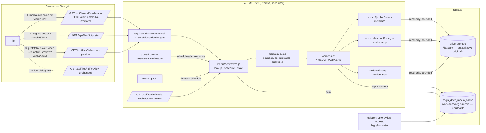

# AEGIS IDEA1 — PR #150 Media Preview Pipeline Design (Server-Side Derivatives + Cache)

Date: 2026-09-18
Status: DESIGN APPROVED — `CHATGPT_REVIEW_PR150_MEDIA_PREVIEW_PIPELINE_ARCHITECTURE = PASS` (all five revision-2 correction areas accepted); implementation planning authorized (`docs/superpowers/plans/2026-09-18-pr150-media-preview-pipeline.md`); implementation, Linux/PostgreSQL verification, Production candidate, browser acceptance, receipt, and merge remain separately gated and are NOT started
Revision 2 corrections: (1) profile version in every derivative URL/ETag and an explicit authenticated-cache isolation policy; (2) Production overlay model separate from the repository compose; (3) truthful CPU/memory wording and a measurable responsiveness guard; (4) family-specific animation detection; (5) temporal-vs-byte bounds for large animated sources and empirical container seek verification. The accepted architecture decisions are unchanged.
Scope: IDEA1 / FILES-MANAGEMENT-UX-1 / Files grid media thumbnails, hover motion, and their generation pipeline
PR: #150 (`feat/idea1-files-management-ux`)
Design basis SHA: `e5bea949a917a84b20e337d8d9d1406ff115af36` (verified source = current Production runtime)
Base `main`: `1867a1bf633a5486e0382a949c95b87217ac7270`
Human-approved direction: **server-side media derivatives + rebuildable cache, FFmpeg/FFprobe, Sharp/libvips permitted for still images.** The choice between client-side poster extraction and server-side derivatives is closed and is not re-opened here.

This document authorizes nothing on its own beyond implementation *planning*. It changes no application source, tests, packages, Dockerfile, compose file, database, or Production state. Implementation follows the companion plan under its own TDD, review, Linux/PostgreSQL verification, and browser-acceptance gates.

---

## 1. Problem statement

The Files grid at `e5bea949` renders media thumbnails from the **original bytes** of each file:

- still images are `` — the browser downloads and decodes the full original to paint a 210 px card;
- video is `<video preload="metadata" src="/api/files/:id/preview#t=0.1">` — the browser issues Range requests for headers and the first frame;
- animated GIF idle posters are produced **in the browser** by `src/lib/gifPoster.js`, which downloads the complete GIF as a Blob, decodes it with `createImageBitmap`, draws the first frame to a canvas, and keeps a PNG object URL; hover swaps the poster for `` of the original.

The size of the original therefore dictates the bytes and the decode work required to draw a tile. For small files this is invisible; for the media sizes that Production actually holds (a 49.7 MB GIF, a 196 MB video) it produces slow posters, a first-hover race, and a mouseleave that can return the tile to an unloaded state.

## 2. Production observation

Recorded by the Human Owner during Round 10 browser acceptance on Production (`e5bea949`):

| Case | Observed |
|---|---|
| A. GIF ≈ 518 KB | Idle poster appears quickly. First hover may still not animate immediately. |
| B. GIF ≈ 49.7 MB | After refresh the idle poster takes a long time to appear. First hover while the poster is loading may reveal frames but does not reliably start animation; often needs mouseleave then hover again; animation can initially stutter; mouseleave may return to an unloaded/missing poster until the original poster generation finishes. |
| C. Video ≈ 196 MB | A visible frame appears earlier than for the 49.7 MB GIF, because `<video preload="metadata">` uses Range requests instead of downloading the whole source. |

`REAL_BROWSER_GIF_STATIC_FRAME` stays `PENDING_BROWSER_ACCEPTANCE` for the current implementation; this design supersedes that approach rather than tuning it.

## 3. Root cause

### 3.1 GIF 49.7 MB — the poster needs the whole original

`createGifPoster()` is `fetch(previewUrl)` → `res.blob()` → `createImageBitmap(blob)` → canvas → `toBlob('image/png')`. Nothing can be shown until the last byte of the GIF has arrived and the whole file has been handed to the decoder. The 96 MiB `GIF_POSTER_MAX_BYTES` ceiling (Round 10 correction) only decides *whether* to attempt this; it does not shorten it. The poster cost is therefore O(original size) in transfer, memory, and decode, and it is paid again on every hard refresh because the object URL lives only in the page.

### 3.2 First-hover race — two competing loads of the same original

While the poster fetch is in flight the tile shows the `gif-static` icon. Hover switches `thumbVariant` to `gif`, which mounts `` for the **same** original: the browser now has a second consumer of a resource that is still streaming into the first (Blob) consumer. Depending on cache state the `` waits for the in-flight response or starts its own; frames become visible only once enough of the GIF has decoded, which is what the Owner saw as "reveals frames but does not reliably start". Mouseleave unmounts that `` and, if the Blob path has still not finished, shows `gif-static` again — the "missing poster" symptom. A second hover works because by then the original is fully cached.

Case A (518 KB) shows a milder version of the same race: the poster is quick, but the first hover still has to fetch/decode the original `` before the browser paints frame 2.

### 3.3 Video is only better by accident

Video tiles avoid the full download because the container format allows `preload="metadata"` + Range. They still depend on the original: every tile in a folder of 196 MB videos issues Range requests against the originals and decodes a full-resolution frame per tile.

## 4. Goals

1. **Grid cost is independent of original size.** After a derivative exists, drawing a tile transfers only a small static poster; hovering an animated tile plays only a small motion proxy. The browser never needs the original image/GIF/video for grid behaviour (`ORIGINAL_GRID_FETCH=NO`).
2. **First hover plays without a second hover.** Static poster is always present underneath; the motion proxy is prefetched for visible animated tiles; if hover happens before the proxy is ready, playback starts automatically when it becomes ready while the pointer is still on the tile.
3. **Large originals are previewable without proportional RAM.** Image sources through the 300 MB+ class and video sources through the 20 GB class must be handled by bounded, seek/stream-based generation, never by loading the whole file into memory.
4. **Derivatives are non-authoritative and rebuildable.** They live in a separate cache volume, are content-addressed by the original's SHA-256, can be deleted at any time, and never touch original bytes, integrity, download, restore, or backup semantics.
5. **No database migration.** Content identity already exists (`files.sha256`). Probe and derivative state live in the cache.
6. **No change to upload ceilings or transfer policy** (`UPLOAD_LIMIT_CHANGE=NO`).
7. **Security posture unchanged or stronger**: owner-only, Vault excluded, object-hiding responses, no user-controlled paths, no shell interpolation, bounded child processes.

## 5. Non-goals

- Raising `MAX_LOGICAL_FILE_BYTES`, `MAX_UPLOAD_BYTES` (1 GiB V1 multer ceiling), chunk-size limits, reverse-proxy body limits, or the Large File policy. Preview *source* size targets in §18 describe what the generator must survive if such a file exists, not what upload permits.
- Changing the security semantics of `GET /api/files/:id/preview` (owner-only, `private, no-store`, Range, CSP sandbox). The full Preview dialog keeps using it.
- Previewing Private Vault content. The server holds ciphertext only; no derivative, probe, or plaintext is ever produced for `vault = true` rows.
- Adding SVG or any executable/document type to the preview allowlist.
- Transcoding originals, generating derivatives for download/share, or producing derivatives for Public Share links.
- Persistent job queue, distributed workers, or an external media service.
- Re-opening the Round 10 client-side poster approach.
- Replacing the `node:20-alpine` base image (its Node 20 line reached end-of-life on 2026-04-30; that upgrade is a separate infrastructure decision and is not bundled into this design).

## 6. Supported media matrix

Extension allowlist remains the authorization boundary and is **not expanded**: the exact set that `PREVIEW_MIME` in `server/routes/api.js` accepts today. Animation is decided by probe evidence, never by extension alone.

| Family | Ext (unchanged allowlist) | Still poster | Animated detection | Motion proxy | Engine |
|---|---|---|---|---|---|
| JPEG | jpg, jpeg | yes | n/a (never animated) | none | sharp |
| PNG / APNG | png | yes | §6.1 APNG rule: `acTL` chunk before the first `IDAT` with `num_frames > 1`, cross-checked by `ffprobe` format `apng` | yes (APNG) | sharp (poster), FFmpeg (motion) |
| WebP (still / animated) | webp | yes | §6.1 WebP rule: `VP8X` animation flag **and** sharp `metadata().pages > 1` | yes when FFmpeg capability probe reports animated-WebP decode; otherwise poster-only (`motion = UNSUPPORTED`) | sharp (poster), FFmpeg (motion) |
| AVIF (still / animated) | avif | yes | §6.1 AVIF rule: `avis` sequence brand **and** a sample-table frame count > 1 from the bounded container probe; duration alone is never sufficient; unprovable → `ANIMATION_UNKNOWN` (poster-only) | yes when proven animated and the FFmpeg capability probe reports the `av1` decoder (dav1d/libaom); otherwise poster-only | sharp (still poster), FFmpeg (animated poster + motion) |
| BMP | bmp | yes | n/a | none | FFmpeg (sharp's prebuilt libvips has no BMP loader) |
| GIF | gif | yes (first frame) | §6.1 GIF rule: a second image descriptor found by a bounded two-packet probe (`ffprobe -read_intervals %+#2`); never a full-file frame count | yes | FFmpeg (poster and motion; the GIF demuxer streams from the file head — the bytes it reads for the first frame / first 6.5 s are bounded by the temporal window, not by a fixed byte count; see §9) |
| MP4 | mp4 | yes (frame at poster time) | always motion-capable | yes | FFmpeg |
| WebM | webm | yes | always motion-capable | yes | FFmpeg |
| SVG, PDF, HTML, any other | — | OUT | — | — | `UNSUPPORTED` |
| Any `vault = true` row | — | OUT (404, never probed) | — | — | — |
| Any `kind = 'folder'` row | — | OUT (400) | — | — | — |

Content whose bytes do not match the extension family (e.g. `.jpg` containing HTML) fails the probe and is `UNSUPPORTED`; nothing is decoded further. The original preview route is unchanged and still serves such a file as a broken image under `nosniff` + CSP sandbox.

**Documented decoder limitations** (surfaced by the startup capability probe, §10.4):

- Animated WebP motion requires an FFmpeg build whose `webp` decoder handles animation (the FFmpeg 7.1 series or later). Older builds decode only the first frame; on such builds animated WebP is poster-only and `media-info` reports `motion.state = UNSUPPORTED` with `reason = DECODER_UNAVAILABLE`.
- Animated AVIF motion requires an `av1` decoder in the packaged FFmpeg. Same degradation.
- If `libx264` is absent from the packaged FFmpeg, motion proxies are globally `UNSUPPORTED` (the design does not silently switch to a different container/codec at runtime; see §10.3).

### 6.1 Family-specific animation rules

There is no generic "frames > 1 or duration > 0" rule. Each family has its own bounded evidence rule; when the rule cannot prove animation within its byte budget the result is `ANIMATION_UNKNOWN`, which is treated exactly like "still" for generation (poster only, `motion.state = UNSUPPORTED`, `reason = ANIMATION_UNKNOWN`) and is reported truthfully as `animated: null` in `media-info`. Generating a motion proxy for a source whose animation is unproven is never allowed.

| Family | Rule (all reads bounded) | Byte budget | Result when evidence is inconclusive |
|---|---|---|---|
| JPEG, BMP | never animated | header only | still |
| PNG / APNG | Walk PNG chunk headers from the signature, skipping chunk bodies by their declared length, until the first `IDAT`. Animated iff an `acTL` chunk appears before `IDAT` (the PNG/APNG specification requires this ordering) **and** its `num_frames > 1`. Cross-check: `ffprobe` reports format `apng`; disagreement → `ANIMATION_UNKNOWN`. | ≤ 32 chunk headers or 64 KiB, whichever first | still (`acTL` absent) / `ANIMATION_UNKNOWN` (budget exhausted before `IDAT`) |
| WebP | Read the RIFF header and the first chunk. Animated iff the first chunk is `VP8X` with the Animation flag set **and** sharp `metadata().pages > 1`. Flag set but `pages ≤ 1` (or sharp cannot read it) → `ANIMATION_UNKNOWN`. No `VP8X`, or flag clear → still. | first 64 bytes + sharp header read | still / `ANIMATION_UNKNOWN` as above |
| GIF | `ffprobe -read_intervals %+#2 -show_packets` reads at most the first two demuxed packets (one packet per image descriptor) and stops. Two packets → animated; one packet followed by the trailer → still. The `NETSCAPE2.0` loop extension in the header is recorded as a hint only and never decides. No full-file `-count_frames` is ever run. | bytes of at most two frames, each bounded by the pixel guard | `ANIMATION_UNKNOWN` if the probe hits its timeout before two packets or the trailer |
| AVIF | Read the `ftyp` box. `avis` absent from major/compatible brands → still (primary item decoded by sharp). `avis` present → bounded container probe (`ffprobe` with `-probesize`) must return a video track with a sample count (`nb_frames`, from the sample table, not from duration) > 1 → animated. `avis` present but the sample count is unavailable, ≤ 1, or the `moov` box is not within the probe budget → `ANIMATION_UNKNOWN`. `durationSeconds > 0` on its own never marks AVIF animated. | `ftyp` + `MEDIA_PROBESIZE_BYTES` | `ANIMATION_UNKNOWN` |
| MP4, WebM | motion-capable by family; no frame counting | container index within `MEDIA_PROBESIZE_BYTES` | n/a |

Fixture contracts (all generated at test time, §23): `STILL_AVIF_NOT_ANIMATED`, `ANIMATED_AVIF_ANIMATED_WHEN_SUPPORTED` (skips to `ANIMATION_UNKNOWN`/poster-only when the packaged decoders cannot prove it), `STILL_WEBP_NOT_ANIMATED`, `ANIMATED_WEBP_ANIMATED`, `PNG_NOT_ANIMATED`, `APNG_ANIMATED`, `ONE_FRAME_GIF_NOT_ANIMATED`, `MULTIFRAME_GIF_ANIMATED`, plus `ANIMATION_UNKNOWN_IS_POSTER_ONLY` (a crafted `VP8X`-flagged single-page WebP must never receive a motion job).

## 7. Architecture diagram



Ownership of each box: everything under `Drive` is `IDEA1-AEGIS_Drive_LC/server/media/**` (new) plus small, explicit touch points in `routes/api.js`, `routes/uploads.js`, `index.js`, `app.js` (health), and the frontend under `src/lib/media*.js` + `src/screens/Files.jsx`. `docker-compose.yml` volume declaration is cross-scope infrastructure and is declared as such in the implementation PR.

## 8. Static poster pipeline

**Purpose**: every still-image thumbnail, the idle frame of animated images, the idle frame of video.

**Output profile `v1`**:

| Property | Value | Why |
|---|---|---|
| Box | fit inside 640 × 360, preserve aspect ratio, never upscale | The card thumbnail box is 96 px tall / ≈210 px wide at up to 2× DPR (≈420 × 192); 640 × 360 gives headroom for list view, larger tiles, and 3× displays without a new profile. |
| Format | WebP, lossy, quality 80, effort 4, alpha preserved | Smallest bytes at thumbnail quality with alpha support; supported by every target browser (Safari ≥ 14). JPEG rejected (no alpha, larger at equal quality). PNG rejected as default (2–5× larger); WebP lossy-with-alpha covers transparency semantics, so a PNG branch is not required for correctness. PNG remains only as the encoder fallback when the FFmpeg build lacks `libwebp` (§10.3) — the file is then `poster.png` and `state.json` records `mime`. |
| Metadata | stripped (no EXIF/ICC/XMP) — colour is converted to sRGB before strip | Thumbnails must not leak camera/location metadata; sRGB conversion keeps colours correct after ICC removal. |
| Orientation | EXIF orientation applied before strip | Camera images render upright. |
| Encoded size bound | ≤ `MEDIA_POSTER_MAX_BYTES` (512 KiB). If the first encode exceeds it, re-encode once at quality 60; if still above, the job fails `PERMANENT / OUTPUT_TOO_LARGE`. | A grid of 60 tiles must stay in the low-MB range. |
| Video poster time | `t = clamp(0.05 × duration, 0.5 s, 3 s)`, clamped to `duration` | Frame 0 is often black/fade-in; a small offset gives a representative frame while staying inside the first key-frame window for short clips. |
| Animated image poster | first frame | Matches the current idle contract (idle = static first frame). |

**Engine per family** (decision detail in §10):

- **Still JPEG / PNG / WebP / AVIF → sharp.** Pipeline: `sharp(absPath, { limitInputPixels: MEDIA_MAX_SOURCE_PIXELS, sequentialRead: true, failOn: 'error' }).rotate().resize(640, 360, { fit: 'inside', withoutEnlargement: true }).toColourspace('srgb').webp({ quality: 80, effort: 4 }).toFile(tmpPath)`. JPEG uses libjpeg shrink-on-load (decodes at 1/2, 1/4, 1/8 scale when the target is small), PNG/WebP use sequential (scanline) access — decoded memory is bounded by a few strips of the reduced image, not by the full-resolution frame.
- **BMP, GIF first frame, animated AVIF first frame, video frame → FFmpeg.** `ffmpeg -nostdin -hide_banner -loglevel error -protocol_whitelist file -threads 1 -filter_threads 1 -probesize MEDIA_PROBESIZE_BYTES -analyzeduration 5000000 [-ss t] -i <abs> -frames:v 1 -vf "scale='min(640,iw)':'min(360,ih)':force_original_aspect_ratio=decrease" -c:v libwebp -quality 80 -y <tmp>`.

**Atomic write**: output goes to `<entry>/poster.webp.tmp-<uuid>` and is `rename(2)`d to `poster.webp` on success; `state.json` is rewritten last (also via tmp + rename). Readers only ever see complete files.

## 9. Motion proxy pipeline

**Purpose**: hover playback only. Never the idle state, never the Preview dialog.

**Input**: animated GIF, animated WebP, APNG, animated AVIF (where decodable), MP4, WebM.

**Output profile `v1`** — `motion.mp4`:

| Property | Value | Why |
|---|---|---|
| Container / codec | MP4, H.264 (`libx264`), `-profile:v main -level 3.1 -pix_fmt yuv420p`, `-movflags +faststart` | Plays natively in every target browser including Safari/iOS; `faststart` puts `moov` first so playback can begin before the last byte. |
| Audio | none (`-an`) | Hover previews are silent; drops bytes and avoids autoplay-with-sound policies. |
| Box | fit inside 480 × 270, even dimensions, never upscale | ≈2× the 210 px tile; yuv420p requires even sizes. |
| Frame rate | `fps=min(source, 12)` | GIF-class motion; halves decode/encode work vs 24–30 fps for a hover cue. |
| Duration | `MEDIA_MOTION_MAX_SECONDS` = 6 s from the source start (`-ss 0 -t 6.5` as **input** options so the demuxer stops reading after that window; `-t 6` on output) | Bounded temporal decode window and bounded encode/output work regardless of total source duration; the source bytes required by that window are not fixed and are measured (see the paragraph below); loops in the tile. |
| Encoder speed / rate | `-preset veryfast -crf 28 -maxrate 1200k -bufsize 2400k -g 24` | Encode latency in the low seconds for a 6 s window; keeps output in the tens-to-hundreds of KB. |
| Encoded size bound | ≤ `MEDIA_MOTION_MAX_BYTES` (4 MiB) — checked after encode; exceeding is `PERMANENT / OUTPUT_TOO_LARGE` | A hover must not cost more than a couple of poster grids. |
| Looping | client-side `<video loop>` | Keeps the file short. |

Command shape (argument array, no shell):

```
ffmpeg -nostdin -hide_banner -loglevel error -protocol_whitelist file
       -threads <MEDIA_FFMPEG_DECODER_THREADS> -filter_threads <MEDIA_FFMPEG_FILTER_THREADS>
       -probesize <MEDIA_PROBESIZE_BYTES> -analyzeduration 5000000
       -ss 0 -t 6.5 -i <abs-original>
       -an -t 6 -vf "fps=12,scale='min(480,iw)':'min(270,ih)':force_original_aspect_ratio=decrease:force_divisible_by=2,format=yuv420p"
       -c:v libx264 -threads:v <MEDIA_FFMPEG_ENCODER_THREADS> -preset veryfast -crf 28 -maxrate 1200k -bufsize 2400k -g 24 -profile:v main -level 3.1
       -movflags +faststart -y <tmp-output>
```

**Why MP4/H.264 and not WebM/VP9**: (1) H.264 MP4 is the only combination that plays in every browser the Drive UI targets without feature detection (VP9 WebM playback on Safari depends on OS/hardware); (2) `libx264 veryfast` encodes several times faster than `libvpx-vp9` at these sizes, which is the dominant cost on a single Production host; (3) the Alpine `ffmpeg` package ships `libx264`; (4) at 480 × 270 / 12 fps / 6 s the bytes difference between the two codecs is immaterial (tens of KB) against the 4 MiB bound. VP8/WebM was rejected for the same compatibility and speed reasons with no offsetting benefit.

**What is bounded, and what is not, for very large sources**:

- The input-side `-t 6.5` bounds the **temporal window** the demuxer/decoder processes; it does **not** bound the number of source bytes that represent that window. A very high-bitrate or huge-frame GIF/APNG can hold a large fraction of a 300 MB file in its first six seconds, and FFmpeg will read those bytes (sequentially, never buffered whole in Node). The guarantees for animated images are therefore: only the 6.5 s window is decoded; frame pixels are guarded (§18); wall-clock is bounded by `MEDIA_MOTION_TIMEOUT_MS`; concurrency is one job; output is capped; and the **measured** source I/O of the job (`/proc/<pid>/io` `rchar`/`read_bytes` on the Linux gate) is recorded in the acceptance evidence, not assumed.
- For MP4/WebM the container index (`moov`/Cues) is located by seeking and read within `MEDIA_PROBESIZE_BYTES`; the poster reads from the seek point to the first decodable frame and the motion proxy reads the first-window samples. Seek/index behaviour **must be verified empirically** per fixture class (faststart MP4, moov-at-end MP4, WebM with Cues, WebM without Cues); a `moov` atom at the end of a file is proportional to sample count, not file size, and its read is measured, not assumed. The "< 64 MiB source read" figure in §24 applies only to the fixture classes for which the integration test proves it.
- No step reads a 10–20 GB file end-to-end when the container index is valid; a container without a usable index is bounded by `-probesize`/timeout and fails truthfully (`GENERATION_FAILED`) rather than scanning the whole file.

## 10. Tooling decision

### 10.1 Decisions

```
POSTER_ENGINE   = SHARP (still JPEG/PNG/WebP/AVIF) with FFMPEG for BMP, animated first frames, and video frames
MOTION_ENGINE   = FFMPEG
PROBE_ENGINE    = FFPROBE (all families) + sharp metadata (still images, animated-WebP page count)
MOTION_OUTPUT   = MP4_H264
```

### 10.2 Why sharp is included (and not for prestige)

Still images are the majority of grid tiles and the only family where the 200–300 MB class is a *pixel* problem rather than a *time* problem. sharp/libvips gives three things FFmpeg's image path does not:

1. **Shrink-on-load for JPEG** (libjpeg DCT scaling) — a 48 MP JPEG destined for 640 × 360 is decoded at 1/8 scale; FFmpeg decodes the full frame.
2. **Sequential/streamed decode for PNG and WebP** — memory is bounded by strips of the *reduced* image; FFmpeg materialises the full RGB frame (a 40 MP PNG is ≈160 MB of decoded pixels before scaling).
3. **A pre-decode pixel guard** (`limitInputPixels`) enforced from the header, in-process, with no child process per thumbnail — lower latency for the common small-image case and one fewer process spawn per tile.

Costs accepted: one native dependency (`@img/sharp-linuxmusl-x64` prebuilt, ≈12–15 MB installed, no build toolchain required on Alpine ≥ 3.17 / Node ≥ 18.17); native decode runs in the Drive process (a decoder crash is a process crash). Mitigations: the pixel guard rejects oversized inputs before decode, `failOn: 'error'` aborts on corrupt data instead of guessing, `sharp.concurrency(1)` and the single worker slot bound libvips threads, and a config switch `MEDIA_STILL_ENGINE=sharp|ffmpeg` (default `sharp`) lets the deployment fall back to FFmpeg-only for still images without a code change if the native dependency misbehaves on the host. The FFmpeg still-image path is exercised by tests either way because BMP always uses it.

Not included: ImageMagick/GraphicsMagick (redundant with the two engines above), Python/Pillow, any hosted transcoding service.

### 10.3 Runtime packaging (to implement later, not in this gate)

Chosen strategy: **A — `apk add` the Alpine `ffmpeg` package into the runtime stage, version-pinned.**

- Dockerfile runtime stage gains `RUN apk add --no-cache ffmpeg=<exact-version-r<rev>>` placed before `USER node`, and `RUN mkdir -p /var/cache/aegis-media && chown node:node /var/cache/aegis-media` (same pattern and reason as the existing `/datalake` mkdir/chown: the named volume inherits ownership from the image on first creation).
- The `ffmpeg` package installs `ffprobe` and the codec libraries the Alpine build is linked against (`libx264`, `libvpx`, `libwebp`, and an AV1 decoder are the ones this design depends on; the capability probe verifies each at boot rather than assuming the package contents). Expected image growth: **≈ +90–120 MB uncompressed layer** (measured and recorded in the implementation receipt; the acceptance bound is ≤ 150 MB added or the strategy is re-reviewed). The package exists in the Alpine `community` repository, which the official `node:*-alpine` images already enable.
- **Pinning**: the version string is fixed in the Dockerfile to the exact `ffmpeg` package of the Alpine release behind the pinned `node:20-alpine3.<n>` tag (the base image tag itself is pinned to an Alpine minor, not the floating `node:20-alpine`). Renovate-style bumps are explicit commits. The startup capability probe (§10.4) logs `ffmpeg -version` so the running version is always observable.
- **musl**: FFmpeg from Alpine is a native musl build (no glibc shim). sharp ships a prebuilt `linuxmusl-x64` binary for the musl generation that every Alpine release behind the Node 20 images uses (Alpine ≥ 3.17); `npm ci` on the runtime stage must resolve that prebuilt and the build must fail if it would fall back to compiling from source.
- **Execution model**: `child_process.execFile`/`spawn` with argument arrays only; `-nostdin`; stdout/stderr captured with a 64 KiB cap; `AbortSignal`-driven timeout that sends `SIGKILL` (`SIGTERM` first, `SIGKILL` 2 s later); the child inherits a minimal environment (`PATH`, `HOME=/tmp`, no secrets — the Drive process environment holds `DATABASE_URL`/`SESSION_SECRET` and must not be inherited by a media decoder). Working directory = the cache tmp directory.
- **Strategy B (separate FFmpeg image/sidecar)** rejected for complexity, not for lack of benefit: a separate container **would** give stronger isolation (its own cgroup CPU/memory limits, its own PID namespace, no native decoder inside the Drive process). It is rejected because it needs a shared read-only mount of `/datalake` into a second container, an RPC boundary, a second image to pin, and a second Production overlay/rollback surface. The in-process design accepts a soft, process-configuration CPU bound (§13.2, §18) and stays honest about it; if Production measurement (§24 `RESOURCE_RESPONSIVENESS`) shows the soft bound is insufficient, the sidecar is the documented escalation path.
- **Strategy C (static FFmpeg binary vendored into the repo/image)** rejected: no distro security updates, larger binary, and it bypasses the Alpine package pin that the rest of the image relies on.

### 10.4 Startup capability probe

At boot (`index.js`, after `initStorage()`), `media/capabilities.js` runs `ffmpeg -version`, `ffmpeg -hide_banner -decoders`, `ffmpeg -hide_banner -encoders`, and `ffprobe -version` (each with a 10 s timeout), and loads sharp. It records a frozen capability object: `{ ffmpeg: { version, ok }, ffprobe: { ok }, encoders: { libx264, libwebp }, decoders: { gif, apng, webp, webpAnimated, av1, h264, vp8, vp9 }, sharp: { version, ok, avif } }`. Missing pieces **degrade** (`media-info` reports `UNSUPPORTED` with a `reason`) — they never prevent the Drive from starting, because file management must not depend on a thumbnail toolchain. `/healthz` gains a `media` block `{ enabled, ffmpeg, sharp, cacheWritable }` (additive; the existing `application/db/storage` probes are unchanged and health remains `ok` when only `media` is degraded).

## 11. Cache layout

Root: `MEDIA_CACHE_DIR` (default `/var/cache/aegis-media`), mounted from a **separate** Docker named volume whose Docker-level name is exactly `aegis_drive_media_cache` — the compose declaration sets `name: aegis_drive_media_cache` explicitly so the deployed name does not acquire a project prefix (the Production project is `aegis-prod`; its protected volumes are likewise explicitly named `aegis_drive_storage` and `aegis_postgres_data`). It is not under `STORAGE_ROOT`, so `resolveKey()` can never resolve into it and no backup/restore/integrity path can see it.

```
/var/cache/aegis-media/
  README                          # one line: "rebuildable derivative cache — safe to delete"
  tmp/                            # in-progress outputs: <jobId>.<type>.tmp-<uuid> ; cleaned at startup
  v1/                             # derivative profile version (§12)
    ab/cd/<sha256-hex-64>/        # two-level fan-out on the first 4 hex chars
      probe.json                  # normalised probe result (§13.3)
      state.json                  # per-type state machine + attempts + lastAccess (§13.4)
      poster.webp                 # or poster.png (encoder fallback), mime recorded in state.json
      motion.mp4                  # only for animated/video sources with motion supported
```

Properties:

- **Deletable at any time**, in whole or per entry. A missing file means "not generated"; a request enqueues regeneration.
- **Not the source of truth**: nothing in the DB references it; `files.sha256`, `size_bytes`, integrity verify, download, versions, trash, restore, and backup are unaware of it.
- **Never mutates originals**: every generator opens the original read-only via `resolveKey()`; the cache tree is the only writable location and it is outside `STORAGE_ROOT`.
- **Backup**: the Host Backup Agent targets and the Drive backup contract enumerate `/datalake` and PostgreSQL; the cache volume is deliberately outside both and is documented as *excluded* — restoring a backup yields a cold cache, which is correct.
- **Fallback without the volume**: if `MEDIA_CACHE_DIR` is not a mount (e.g. the media overlay was not applied), the directory lives in the container's writable layer. The feature works but the cache is lost on container recreation. `/healthz.media.cacheVolume = "ephemeral"` makes this visible; the overlay in §25 is the intended state.
- **Volume lifecycle semantics** (Docker facts, not design choices): a named volume cannot be removed while any container — running or stopped — references it (`docker volume rm` fails with "volume is in use"). Removing the cache therefore means either emptying it from inside the running container (`find /var/cache/aegis-media -mindepth 1 -delete`, safe at any time because the cache is rebuildable and every write is tmp + rename) or, after the Drive container has been recreated **without** the mount (§26 rollback model), `docker volume rm aegis_drive_media_cache` on the then-unused volume.

## 12. Cache identity / versioning

```
CACHE_IDENTITY = SOURCE_SHA256 + PROFILE_VERSION + DERIVATIVE_TYPE
entry key      = v1/<sha256>/<type>
```

- `sha256` is `files.sha256` — server-measured at V1 upload (`sha256OfFile`) and V2 commit (`stagedPartSha256`), never client-supplied. After migration 010, every non-vault `kind = 'file'` row that passed the fail-closed gate has a non-empty checksum (an empty checksum is not creation evidence and blocks the migration). Version restore and same-name replace swap `files.sha256` to the restored/new content's checksum, so the key follows content automatically. A row with `sha256` NULL/empty (possible only in the in-memory dev store or a hand-edited database) is `UNSUPPORTED / NO_CONTENT_IDENTITY`; the design does not compute a checksum on demand (a 20 GB read is not a thumbnail cost).
- **Rename** does not change `sha256` → same entry → no regeneration. Filename never enters the key or the path; the only user-influenced input is the extension used to pick the decoder family, and the probe verifies the bytes against it.
- **Replace bytes** (same-name upload, V2 commit new version, restore version) → new `sha256` → new entry. The old entry is simply unreferenced and ages out.
- **Identical bytes across users** → the same entry is reused. This is safe because a requester must own a row with that exact checksum to reach the entry (§17.4).
- **Old derivative can never be served for new content or for an old profile**: every binary URL carries both identities, `v=<sha256>` (source version) and `p=<profile>`; the route resolves `sha256` from the row at request time and the current profile from `MEDIA_PROFILE_VERSION`, and a mismatch on either is answered as not found (§14.3, §14.6). The URL therefore changes whenever either the bytes or the profile change, which is what makes one-year immutable caching safe.
- **Profile version** `v1` is part of the disk path, of `media-info` (`profile`), of every poster/motion URL (`p=v1`), and of every `ETag` (`"<sha256>-v1-poster"`, `"<sha256>-v1-motion"`). Changing box, format, fps, duration, quality, encoder settings, or engine defaults **bumps the profile** (`v2`) and the `MEDIA_PROFILE_VERSION` constant; the semantics of an existing profile are never changed in place. Old `v1` entries are not migrated, they are evicted normally; a browser holding a `p=v1` URL never receives a `v2` object from it (`PROFILE_V1_CACHE_URL ≠ PROFILE_V2_CACHE_URL`, `OLD_PROFILE_CANNOT_MASK_NEW_PROFILE`). `probe.json` carries `probeVersion` separately so a probe-format change alone does not invalidate encoded outputs.

## 13. Job queue design

Module: `server/media/queue.js` (generic bounded queue) + `server/media/derivatives.js` (media-specific service). In-process, non-persistent — the cache is rebuildable, so a restart may drop queued jobs and the next request enqueues again.

### 13.1 Job identity and de-duplication

Job key = `<profile>/<sha256>/<type>` where `type ∈ { probe, poster, motion }`. A `Map<jobKey, Job>` holds queued and running jobs; a second request for the same key attaches to the existing promise and may **raise its priority** but never creates a second process. `poster` and `motion` depend on `probe`; scheduling `poster` implicitly schedules `probe` first (same de-dup rules).

### 13.2 Priorities and bounds

| Priority | Source | Notes |
|---|---|---|
| P0 interactive | a `media-info`/`poster`/`motion-preview` request that found a cache miss | served first |
| P1 upload | scheduled after a successful commit | |
| P2 warm-up | warm-up CLI | preempted while any P0/P1 job is waiting; the CLI also self-throttles |

- Concurrency: `MEDIA_WORKERS` default **1** (max 2): by default exactly one heavy media generation pipeline (one FFmpeg child or one sharp pipeline) runs at a time.
- FFmpeg thread model (`CPU_BOUND=SOFT_PROCESS_CONFIGURATION`): decoder threads `-threads 1` placed before `-i`; filter threads `-filter_threads 1` (and `-filter_complex_threads 1` only if a filter-complex graph is ever used — the current graphs are simple `-vf` chains); encoder threads `-threads:v MEDIA_FFMPEG_ENCODER_THREADS` (default 2) on the output. These options configure the codec/filter thread pools; they are **not** a cgroup CPU limit — libx264 lookahead, the demuxer, and I/O threads exist outside them. The design does not claim a hard core limit; the only hard bound is that at most `MEDIA_WORKERS` children exist. sharp is configured with `sharp.concurrency(1)`, which likewise limits the libvips worker pool, not the process.
- Queue depth: `MEDIA_QUEUE_MAX` (default 500). When full, new P0 requests are answered `RETRYABLE` (HTTP 503 + `Retry-After`) and nothing is enqueued; P1/P2 scheduling is dropped silently (a later request re-enqueues).
- Per-job timeouts: probe 20 s, poster 60 s, motion 120 s (`MEDIA_*_TIMEOUT_MS`). Timeout → `SIGTERM`, then `SIGKILL` after 2 s, tmp output removed, job marked `TRANSIENT / TIMEOUT`.
- Cancellation: a job whose only interactive requesters disconnected is not cancelled (the output is still useful for the next viewer), but it is demoted to P2. Shutdown (`SIGTERM` to the Drive) kills running children and abandons the queue; tmp files are cleaned at the next start.
- Memory assumptions: child memory is bounded by the decoded frame size (guarded by §18 pixel limits) plus encoder state; the Node process holds only job metadata and never buffers media bytes (sharp streams file → file; FFmpeg writes to a file). A `media-info` batch of 64 ids costs 64 `stat`/small-JSON reads.
- CPU: the pipeline is expected to occupy roughly one to three cores while a job runs (soft configuration, measured in Production acceptance — §24 `RESOURCE_RESPONSIVENESS`); the Files list, health, and upload paths are never on this queue and are served by the event loop, which the child processes cannot block.

### 13.3 Probe result (`probe.json`)

```json
{
  "probeVersion": 1,
  "family": "gif",
  "container": "gif",
  "codec": "gif",
  "width": 800, "height": 450,
  "pixels": 360000,
  "frames": 143,            // null when unknown
  "durationSeconds": 5.72,  // null for stills
  "animated": true,         // true | false | null (null = ANIMATION_UNKNOWN → poster-only)
  "animationEvidence": "gif-second-packet",   // family rule that decided (§6.1)
  "hasAlpha": false,
  "rotation": 0,
  "engine": "ffprobe",
  "measuredAt": "2026-09-18T00:00:00Z"
}
```

`animated` is decided only by the family-specific rule in §6.1 (`animationEvidence` names it); it is always `true` for mp4/webm and `null` when the rule was inconclusive. Sources whose probe fails, whose family disagrees with the extension, or whose dimensions exceed the guard are recorded as `UNSUPPORTED` with a `reason` and are never handed to an encoder; `animated: null` sources receive a poster job only.

### 13.4 State (`state.json`)

```json
{
  "profile": "v1",
  "sha256": "…",
  "poster": { "state": "READY", "file": "poster.webp", "mime": "image/webp", "width": 640, "height": 360, "bytes": 38112, "attempts": 1, "generatedAt": "…" },
  "motion": { "state": "PENDING", "attempts": 0, "nextRetryAt": null, "reason": null },
  "lastAccess": "2026-09-18T00:00:00Z"
}
```

Per-type states: `PENDING` (queued or running), `READY`, `UNSUPPORTED` (permanent for this profile: not applicable, decoder missing, guard exceeded, family mismatch), `GENERATION_FAILED` (permanent after retries exhausted), `RETRYABLE` (transient failure, `nextRetryAt` set). Writes are tmp + rename; readers tolerate a missing `state.json` (treated as `PENDING` and enqueued).

### 13.5 Retry policy

| Failure class | Examples | Policy |
|---|---|---|
| TRANSIENT | timeout, `SIGKILL`ed, `ENOSPC` on cache, queue full, cache below free reserve | retry with backoff 1 min → 5 min → 30 min; max 3 attempts; then `GENERATION_FAILED` with `reason` |
| PERMANENT | decoder error, corrupt container, family mismatch, pixel/duration guard, output too large, unsupported codec | no retry for this profile; `GENERATION_FAILED` / `UNSUPPORTED` persisted in `state.json` |

A permanent failure is cleared only by a profile bump, an explicit admin invalidate (`DELETE /api/admin/media-cache/entries/:sha256`, Admin role, audited), or eviction of the entry — after which one fresh attempt is allowed. This keeps a hostile file from consuming CPU in a loop while still allowing recovery after a toolchain upgrade.

### 13.6 Trusted inputs only

The generator receives `{ sha256, storageKey, ext, size }` from the service, resolves `storageKey` through `resolveKey()` (path-traversal guard, must be under `STORAGE_ROOT`), and refuses any key that does not resolve or does not exist. Output paths are computed from `sha256` (validated `^[0-9a-f]{64}$`) and the cache root only. No string from the request, the filename, or the DB ever reaches a command line unvalidated; there is no shell.

## 14. HTTP API

All routes: `requireAuth`; owner check identical to `/preview` (`file.ownerId` must equal `req.user.id`; `null` owner is not the requester); cross-owner → `404` + audit `FILE_PREVIEW DENIED` (object-hiding, same as today); `vault = true` → `404` (never probed); `kind = 'folder'` → `400`; extension outside the allowlist → `UNSUPPORTED` (`415` on binary routes). Successful reads are not audited (same rationale as the Round 8 preview route: dozens of requests per grid would bury real audit events).

### 14.1 `GET /api/files/:id/media-info`

Returns the derivative state for one file and enqueues generation on a miss.

- `200` `application/json`:

```json
{
  "id": "123",
  "sourceVersion": "<sha256>",
  "profile": "v1",
  "family": "gif",
  "animated": true,
  "width": 800, "height": 450, "durationSeconds": 5.72,
  "poster": { "state": "READY", "url": "/api/files/123/poster?v=<sha256>&p=v1", "etag": "\"<sha256>-v1-poster\"", "width": 640, "height": 360, "mime": "image/webp" },
  "motion": { "state": "PENDING", "url": null, "retryAfterMs": 2000 },
  "status": "PARTIAL"
}
```

`sourceVersion` is the row's current `sha256`; `profile` is the current `MEDIA_PROFILE_VERSION`. The client treats the `url` fields as opaque (it never assembles `v`/`p` itself), so a profile bump changes every URL the grid uses on the next `media-info` response. `animated` is `true`, `false`, or `null` (`ANIMATION_UNKNOWN`, §6.1).

`status` summarises: `READY` (everything applicable is ready), `PARTIAL` (poster ready, motion pending/unsupported/failed), `PENDING` (poster pending), `UNSUPPORTED` (no derivative will ever exist for this profile — includes `reason`), `GENERATION_FAILED` (permanent; includes `reason`), `RETRYABLE` (transient; includes `retryAfterMs`).

- HTTP status is always `200` for a well-formed, authorised request — the JSON carries the state. (`202` is reserved for the binary routes, where the body cannot carry state.) `Cache-Control: private, no-store`.
- Side effect: if any applicable derivative is missing and not permanently failed, the route enqueues it at P0 before responding; the response reflects `PENDING` with a `retryAfterMs` hint computed from queue position (1 s minimum, 15 s maximum).

### 14.2 `POST /api/files/media-info/batch`

Body `{ "ids": ["123", "124", …] }`, at most 64 ids, CSRF-protected like every other POST. Response `{ "items": { "123": <media-info>, "124": { "status": "NOT_FOUND" } } }`. Each id is subject to the same per-file authorization; unauthorised, vault, folder, or unknown ids are reported as `NOT_FOUND` (object-hiding — `NOT_FOUND` is indistinguishable across those cases, and cross-owner attempts are audited `DENIED` per id). This is the grid's primary call: one request per viewport batch instead of one per tile.

### 14.3 `GET /api/files/:id/poster?v=<sha256>&p=<profile>`

Both query parameters are mandatory and both are validated **after** the owner gate: `v` must match the row's current `sha256` (source identity) and `p` must equal the server's current `MEDIA_PROFILE_VERSION` (derivative identity). The served file is `<cache>/<p>/…/<v>/poster.webp` — the URL and the disk key are the same triple (`sha256`, profile, type).

- `200` + `image/webp` (or `image/png` when the fallback encoder produced it), headers: `X-Content-Type-Options: nosniff`, `Content-Disposition: inline; filename*=UTF-8''poster.webp`, `Content-Security-Policy: default-src 'none'; sandbox`, `Cross-Origin-Resource-Policy: same-origin`, `ETag: "<sha256>-<profile>-poster"` (source SHA + profile + derivative type), `Content-Length`, and the cache headers of §14.6. Supports `If-None-Match` → `304` (the `304` carries the same cache headers).
- `202` + `Retry-After: <s>` + empty body when pending (enqueues at P0).
- `415` when the file is `UNSUPPORTED` for posters. `422` when `GENERATION_FAILED` (permanent). `503` + `Retry-After` when `RETRYABLE`.
- `404` for unknown/cross-owner/vault (object-hiding), for a `v` that does not match the row's current `sha256` (`STALE_SOURCE_SHA=404`; the client re-lists), and for a `p` that is not the current profile (`UNKNOWN_PROFILE=404`; a superseded profile is not served even if its file still exists on disk).
- `400` when `v` or `p` is absent or malformed (the immutable URL contract requires both).

### 14.4 `GET /api/files/:id/motion-preview?v=<sha256>&p=<profile>`

Same gate, parameter validation, and status semantics as the poster route, with `video/mp4`, `Accept-Ranges: bytes` and single-range `206` support reusing the existing `parseByteRange()` (extracted into `server/request/byteRange.js` so both routes share it), `Content-Disposition: inline; filename*=UTF-8''motion.mp4`, same CSP/CORP/nosniff, `ETag: "<sha256>-<profile>-motion"`. `415` also covers "still image — motion not applicable", "animation unknown" and "decoder unavailable" (`media-info` gives the reason).

### 14.5 `GET /api/files/:id/preview` — unchanged

Owner-only, Range, `private, no-store`, CSP sandbox, allowlist — byte-for-byte the Round 8 contract. Used by the Preview dialog only.

### 14.6 HTTP cache strategy

**Final policy for `200`/`304` on `poster` and `motion-preview`:**

```
Cache-Control: private, max-age=31536000, immutable
Vary: Cookie
ETag: "<sha256>-<profile>-<type>"
```

**Why the URL may be immutable.** The bytes are a pure function of the triple (`sha256`, profile, type) and the URL names all three (`:id` + `v` + `p`, with `:id` → row → `sha256` verified on every uncached request). Replacing content changes `v`; changing encoding semantics changes `p`; neither can be served from an old URL (§14.3 returns `404`), so a browser can never keep a stale poster for content or a profile that has since changed.

**Why `private` alone is not the isolation mechanism.** `private` only forbids shared caches. Inside one browser profile the HTTP cache is keyed by URL, so without `Vary` the following would reuse bytes without any server request: user A views a poster → logs out → user B logs in on the same browser profile → B's page requests the same URL → the cache answers from A's entry → the server's ownership gate never runs. (B would only reach that URL through B's own `media-info`, i.e. B owns identical bytes, but the design does not rely on that — the ownership gate must execute.)

**Isolation mechanism: `Vary: Cookie`, made authoritative by the verified session lifecycle.** With `Vary: Cookie` a cached entry is reusable only for a request whose `Cookie` request header is identical to the one stored with the entry. The Drive session model at `e5bea949` (`server/auth/session.js`) guarantees that the cookie value differs across accounts and across logins:

- cookie `aegis.drive.sid`, `httpOnly`, `sameSite: 'strict'`, `secure` in production, `saveUninitialized: false` (no cookie exists before login);
- `establishSession()` calls `req.session.regenerate()` **before** writing the user — every login issues a new signed session id (session-fixation defence already in place);
- `destroySession()` calls `req.session.destroy()` **and** `res.clearCookie('aegis.drive.sid')` — after logout the browser sends no session cookie;
- `rolling: true` re-sends the cookie on every response with a refreshed expiry but the **same signed id**, so the `Cookie` header stays stable within one session (cache hits) and differs between sessions (cache misses → server gate);
- session ids are 24-byte random values signed with `SESSION_SECRET`; they are never reused.

Consequences, each with a contract test (§23 `AUTH_CACHE_ISOLATION`):

| Scenario | Browser cache | Server |
|---|---|---|
| A views poster | miss → `200`, entry stored with A's `Cookie` | owner gate ran |
| A reloads within the session | hit (no request) | — (A's own bytes) |
| A logs out, then the tab (anonymous) requests the URL | `Cookie` header absent ≠ stored → miss | `401` from `requireAuth` |
| B logs in on the same profile and requests the same URL | B's `Cookie` ≠ A's → miss | owner gate runs → `404` (B does not own that file id) |
| A's session expires server-side while the entry is cached | hit inside A's own profile | — (A's own bytes in A's profile; equivalent to a screenshot already on that machine; no cross-account exposure) |
| A logs in again later (new sid) | miss | owner gate runs → `200` |

Notes: other same-origin cookies (HUB, Monitor, or gateway cookies under the same host) change the `Cookie` header too — that can only cause extra misses, never an unsafe hit. Browsers that do not honour `Vary` for a given entry class fall back to a request, never to a wrong hit; `Vary` is a standard cache-key extension in every target browser.

**Dependency made explicit.** The immutable policy is valid **only while** the three session invariants hold (regenerate on login, destroy + clear on logout, no sid reuse). The implementation pins them with `tests/mediaCacheSessionContract.test.js`: it asserts that `establishSession` produces a different `Set-Cookie` sid than the pre-login request and that `destroySession` clears the cookie; if a future session change breaks either, that test fails and the cache policy must be downgraded to the fallback below before merging.

**Fallback policy** (chosen only if the invariants cannot be kept): `Cache-Control: private, max-age=0, must-revalidate` + `ETag`; every tile costs one conditional request answered `304` (a `stat` and a string compare), bytes stay derivative-sized, and the owner gate runs on every render. The fallback is a one-line switch (`MEDIA_CACHE_POLICY=immutable|revalidate`, default `immutable`) so operations can flip it without a redeploy. Auth is never weakened to gain cache speed.

**Non-`200` responses** (`202`, `400`, `404`, `415`, `422`, `503`) and `media-info` carry `Cache-Control: private, no-store`.

### 14.7 Avoiding polling storms

- The grid polls `media-info/batch` for **pending visible tiles only**, with exponential backoff per tile (`retryAfterMs` from the server, then 2 s → 4 s → 8 s → 15 s cap), a hard stop after 120 s of continuous pending (the tile keeps its icon; scrolling away and back or a hover restarts polling once), and a global cap of one in-flight batch poll per grid.
- Server-provided `retryAfterMs` reflects queue position so a long queue naturally slows clients down.
- No `` is pointed at a pending URL (avoids error-driven retries).

### 14.8 Admin observability (Admin role, `requireRole(ROLES.ADMIN)`)

- `GET /api/admin/media-cache/status` → `{ enabled, capabilities, cache: { dir, bytes, entries, highWater, lowWater, lastEvictionAt }, queue: { depth, running, byPriority }, failures: { last24h } }`.
- `DELETE /api/admin/media-cache/entries/:sha256` → evicts one entry (audited `MEDIA_CACHE_INVALIDATE`). No route lists other users' file names; the status view is aggregate only.

## 15. Frontend state machine

Modules: `src/lib/mediaTile.js` (pure state machine, unit-testable), `src/lib/mediaScheduler.js` (viewport priority + concurrency, §16), `src/lib/mediaApi.js` (batch info client with backoff). `src/lib/gifPoster.js` is deleted; `createImageBitmap` is no longer used by the grid.

Per tile, two independent sub-machines plus the hover input:

```
INFO:    unknown ──(visible)──▶ loading ──▶ ready | pending(backoff) | unsupported | failed
POSTER:  none ──(info.poster READY)──▶ loading ──▶ shown          (shown never regresses for the same contentId)
MOTION:  none ──(info.motion READY && animated && !reducedMotion && (near-visible || hover))──▶ prefetching ──▶ ready
HOVER:   idle ◀──▶ hovering
PLAY:    stopped ──(hovering && MOTION=ready)──▶ playing ──(leave)──▶ stopped (pause, currentTime=0)
```

DOM contract (`data-*` attributes keep the existing test style):

- The tile thumbnail box always contains the **poster layer**: file-type icon (plus the `GIF`/`VIDEO` badge for animated families) until `POSTER=shown`, then ``; the `` element is never unmounted while `contentId` is unchanged. `data-poster="icon|loading|shown"`.
- The **motion layer** is a `<video muted playsInline loop preload="auto" tabIndex=-1 aria-hidden>` positioned over the poster, mounted only when `MOTION ≠ none`, `opacity: 0` unless `PLAY=playing`. `data-motion="none|prefetching|ready|playing"`. Its `src` is `motion-preview?v=…`; `canplaythrough` (or `loadeddata` on browsers that never fire `canplaythrough` for small files) moves `MOTION` to `ready`.
- **First-hover contract** (§3.2 fix): `hovering && MOTION=ready → play()`. If `hovering` becomes true while `MOTION=prefetching`, the tile stays on the poster, the scheduler promotes this tile's motion fetch to P0, and the `MOTION=ready` transition re-evaluates `PLAY` — playback starts without leaving. If `MOTION=none` on hover (offscreen-prefetch skipped), hover starts the prefetch at P0. `mouseleave` → `pause()`, `currentTime = 0`, opacity 0; the poster underneath was never removed, so there is nothing to reload.
- `prefers-reduced-motion`: `MOTION` stays `none`; no prefetch; hover does nothing (Preview dialog still available via the menu — unchanged Round 9 rule).
- Identity: `contentId` (= `file.sha256` from the list DTO, already exposed) replaces `id + name` as the reset key for poster/motion; a rename keeps the poster, a content replace resets both layers and the failure memo. The poster/motion URLs are taken verbatim from `media-info` (they already carry `v` and `p`); the client never composes them, so a server-side profile bump is picked up on the next `media-info` response without a client release.
- Failure memo: `INFO=unsupported|failed` is remembered per `contentId` (no re-request on re-render); `pending` is retried per §14.7.
- Video idle uses the poster derivative; the tile no longer mounts `<video src=/preview>`; therefore no Range requests to originals from the grid.
- Still images: `` replaces ``; while `INFO/POSTER` are not ready the tile shows the icon (never the original).
- List view rows use the same `INFO/POSTER` machine with a 32 px poster (same derivative file; the browser scales).
- Preview dialog: unchanged (`/preview` original, Range, controls).

## 16. Viewport scheduling

`mediaScheduler.js` owns one `IntersectionObserver` per grid canvas with two thresholds via `rootMargin`: `visible` (`0px`) and `near` (`50% 0px 50% 0px`, i.e. half a viewport above and below). Each tile registers on mount (reusing the existing `registerTile` plumbing from the marquee work) and unregisters on unmount.

Priority ladder (lower number runs first; ties FIFO by registration order, which follows DOM order):

| Priority | Work | Trigger |
|---|---|---|
| P0 | `media-info/batch` for newly visible tiles; poster `` for visible tiles; **motion prefetch/play for the hovered tile** | visible / hover |
| P1 | motion prefetch for visible + near animated tiles | after their poster is `shown` |
| P2 | `media-info` + poster for near tiles | scroll approaches |
| P3 | motion prefetch for near-only animated tiles | after P1 drains |

Concurrency bounds (browser side): `MAX_INFO_BATCH_INFLIGHT = 1` (batches of ≤ 64 ids), `MAX_POSTER_INFLIGHT = 6` (`` elements are only assigned `src` when a slot is free; `loading="lazy"` is not relied upon because it is not priority-controllable), `MAX_MOTION_INFLIGHT = 3` (`<video>` receives `src` only from the scheduler; hover pre-empts by pausing the lowest-priority in-flight prefetch — its `src` is cleared and it re-queues). Tiles leaving the `near` band have their queued (not in-flight) work removed. No motion prefetch is ever issued for tiles outside the `near` band, so a folder with 2,000 animated files costs at most the visible+near window.

## 17. Security model

### 17.1 Authorization

Every derivative route repeats the exact owner gate of `/preview` (`ownerId` equality with the session user; Admin has no override — same as every file route). Object-hiding: unknown, cross-owner, and vault all answer `404`; folder answers `400` only after the owner gate. Batch results use `NOT_FOUND` for the same set.

### 17.2 Vault

`vault = true` rows are rejected before any storage access, probe, or enqueue. The pipeline never receives a vault storage key. This is a hard invariant enforced in `derivatives.js` as well as in the routes (defence in depth): the service refuses `{ vault: true }` even if a route bug passed it.

### 17.3 No user-controlled paths or commands

Inputs to the generator are `sha256` (regex-validated), `storageKey` (resolved by `resolveKey()`), and `ext` (must be in the allowlist). Output paths derive from `sha256` under the cache root. Commands are argument arrays via `execFile`/`spawn` (`shell: false`), `-nostdin`, `-protocol_whitelist file`, and FFmpeg receives an absolute filesystem path (never a URL-shaped string). Filenames are never passed to FFmpeg/sharp.

### 17.4 Content-hash sharing is not an oracle

Entries are shared by `sha256` across owners, but the only URLs are `/api/files/:id/...` bound to the requester's own row. To observe cache state for a checksum a user must already own bytes with that checksum; `READY` vs `PENDING` on their first request reveals nothing beyond what owning the bytes already gives them. No route accepts a bare hash.

### 17.5 Served bytes are inert

Posters and proxies are generated WebP/PNG/MP4 — re-encoded pixels, not copies of the original. They are served with `nosniff`, `Content-Security-Policy: default-src 'none'; sandbox`, `Cross-Origin-Resource-Policy: same-origin`, and `inline` disposition — identical to the original preview route. A poster derived from a `.jpg` that contained HTML is either `UNSUPPORTED` (probe rejects it) or a genuinely re-encoded image; it can never be HTML.

### 17.6 Metadata hygiene

All derivatives strip EXIF/XMP/ICC (after applying orientation and sRGB conversion). A thumbnail must not leak GPS coordinates or device identifiers that the original carries.

### 17.7 Process isolation

Child processes run as the `node` user, with a minimal environment (no `DATABASE_URL`, `SESSION_SECRET`, or bootstrap credentials), with `cwd` in the cache tmp directory, bounded stdout/stderr capture, and hard timeouts with `SIGKILL`. The Drive process never reads media bytes into JavaScript memory.

### 17.8 Browser cache isolation across accounts

Derivative responses are cacheable for a year only under `Vary: Cookie` and the verified session lifecycle (§14.6). The contract is that the ownership gate executes for every request whose session differs from the one that populated the cache entry, including logout → anonymous and logout → other account on the same browser profile. This is tested at the HTTP layer and in browser acceptance (§23, §24 `AUTH_CACHE_ISOLATION`).

### 17.9 Audit

Cross-owner and vault attempts on all three routes → `FILE_PREVIEW DENIED` (existing action, no new taxonomy). Admin invalidation → `MEDIA_CACHE_INVALIDATE`. Successful derivative reads are not audited (see §14 preamble).

## 18. Resource limits

All values are design defaults, overridable by environment variables validated at boot in `server/config/mediaLimits.js` (same pattern as `transferLimits.js`: invalid values refuse to start).

| Constant / env | Default | Applies to | Rationale |
|---|---|---|---|
| Source byte size | **no cap** | all | A byte cap is exactly what recreated the 49.7 MB problem. Safety comes from pixel, duration, probe-size, and time bounds, not from file size. |
| `MEDIA_MAX_SOURCE_PIXELS` | 40,000,000 (≈ 8000 × 5000) | image posters (sharp `limitInputPixels`; FFmpeg path checks `probe.width × height` first) | Bounds decoded memory: 40 MP × 4 B = 160 MB worst case on the FFmpeg path; sharp's streamed path stays far below. Above → `UNSUPPORTED / DIMENSIONS`. |
| `MEDIA_MAX_VIDEO_FRAME_PIXELS` | 35,389,440 (8192 × 4320) | video and animated-image frames | 8K ceiling; larger → `UNSUPPORTED / DIMENSIONS`. |
| `MEDIA_POSTER_BOX` | 640 × 360 | poster | §8 |
| `MEDIA_MOTION_BOX` | 480 × 270 | motion | §9 |
| `MEDIA_MOTION_FPS` | 12 | motion | §9 |
| `MEDIA_MOTION_MAX_SECONDS` | 6 | motion | bounds demux window, decode, encode, and output bytes; the `fps` filter bounds emitted frames to 72 |
| `MEDIA_PROBESIZE_BYTES` | 32 MiB | ffprobe/ffmpeg `-probesize`; `-analyzeduration 5000000` | container analysis is bounded even for a 20 GB file or a stream with no index |
| `MEDIA_POSTER_MAX_BYTES` | 512 KiB | poster output | §8 |
| `MEDIA_MOTION_MAX_BYTES` | 4 MiB | motion output | §9 |
| `MEDIA_WORKERS` | 1 (max 2) | queue | exactly one heavy generation pipeline at a time by default — the only **hard** concurrency bound |
| `MEDIA_FFMPEG_DECODER_THREADS` | 1 | ffmpeg input `-threads` (before `-i`) | codec thread pool for decoding (soft) |
| `MEDIA_FFMPEG_FILTER_THREADS` | 1 | ffmpeg `-filter_threads` (`-filter_complex_threads` only if a filter-complex graph is introduced) | filter graph thread pool (soft) |
| `MEDIA_FFMPEG_ENCODER_THREADS` | 2 | ffmpeg output `-threads:v` | libx264 thread pool (soft; lookahead/demux/I-O threads are outside it) |
| `CPU_BOUND` | `SOFT_PROCESS_CONFIGURATION` | statement of truth | thread options are per-stage hints, not a cgroup limit; a hard core limit would require a container-level `cpus:` constraint or the sidecar of §10.3, neither of which is in this design |
| `MEDIA_PROBE_TIMEOUT_MS` / `MEDIA_POSTER_TIMEOUT_MS` / `MEDIA_MOTION_TIMEOUT_MS` | 20,000 / 60,000 / 120,000 | per job | hang protection; `SIGTERM` then `SIGKILL` |
| `MEDIA_QUEUE_MAX` | 500 | queue depth | encode-storm protection; overflow → `RETRYABLE` |
| `MEDIA_CACHE_MAX_BYTES` | 2 GiB | cache budget | §19 |
| `MEDIA_CACHE_LOW_WATER` | 0.80 | eviction target | §19 |
| `MEDIA_CACHE_FREE_RESERVE_BYTES` | 512 MiB | cache volume free space | refuse generation (`RETRYABLE / DISK`) when the cache filesystem has less free space than this, so the cache cannot fill its volume |
| child stdio capture | 64 KiB | logging | bounded memory for diagnostics |
| `media-info/batch` ids | 64 | API | bounded per-request work |

Explicit protections mapped to threats:

- **Decompression bombs / pathological dimensions**: dimensions come from headers (`ffprobe` streams, sharp metadata) before any pixel is decoded; the pixel guards reject before decode. FFmpeg's own `-max_alloc` is not relied on.
- **Malformed media**: probe failure is `PERMANENT`; sharp `failOn: 'error'`; FFmpeg non-zero exit is `PERMANENT` unless it was a timeout/kill (`TRANSIENT`).
- **Endless animation / extreme frame count**: `-t` on input and output plus `fps=12` bound the decoded temporal window and the emitted frames independently of the source's frame count; the source bytes read for that window are family/bitrate dependent and are measured (§9, §24).
- **Hostile codec complexity / hangs**: per-job wall-clock timeouts with `SIGKILL`; one worker slot (hard); per-stage thread configuration (soft).
- **Concurrent encode storms**: single worker, queue cap, per-key de-duplication, client-side viewport bounds.
- **Cache disk exhaustion**: byte budget with high/low water eviction, free-space reserve, atomic tmp+rename, startup tmp cleanup.
- **Whole-file RAM buffering**: never happens by construction — sharp reads sequentially from a path, FFmpeg demuxes from a path with bounded `-probesize`/`-t`, the Node process only passes paths and never creates a Buffer/Blob of media bytes. This is a statement about memory, not about disk I/O: a high-bitrate first window can still require substantial sequential reads (§9).

## 19. Cache eviction

- **Index**: at startup `media/cacheIndex.js` scans `v*/` once (directory walk, `stat` of derivative files, read of `state.json.lastAccess`) and builds an in-memory `{ sha256 → { bytes, lastAccess, pinned } }` map plus a running total. The scan is I/O-light (thousands of small entries) and runs after `app.listen` so it never delays serving; until it finishes, eviction is deferred.
- **Last access**: updated in memory on every poster/motion `200`/`304`; persisted to `state.json` at most once per hour per entry (coalesced) to avoid a write per tile render. Filesystem `atime` is not relied upon.
- **Trigger**: after every job completion and every 10 minutes: if `total > MEDIA_CACHE_MAX_BYTES` (high-water), evict least-recently-accessed entries until `total ≤ MEDIA_CACHE_LOW_WATER × MEDIA_CACHE_MAX_BYTES`.
- **Pinning**: entries with a queued/running job, or accessed within the last 60 s, are skipped in that pass.
- **Unit of eviction**: the whole `<sha256>/` directory (probe, state, poster, motion) — partial entries are avoided so `state.json` never describes a file that is gone. Removal is `rename` to `tmp/evict-<uuid>` then recursive unlink, so a concurrent reader either sees the complete entry or none.
- **Startup cleanup**: `tmp/*` older than `MEDIA_MOTION_TIMEOUT_MS` is deleted; `v<n>/` directories for profiles older than the current one are evicted first in any pass.
- **Not coupled to file deletion**: trashing/purging a user file does not touch the cache (another owner may hold identical bytes; and the entry is harmless). Entries simply age out.
- **Regeneration after eviction**: the next `media-info`/binary request finds no entry and enqueues — acceptance test `CACHE_EVICTION` (§24).

## 20. Upload integration

After a **successful** commit — V1 `POST /api/files/upload` (new file and same-name replace), V2 `POST /api/files/uploads/:id/commit` (new file and new version), and `POST /api/files/:id/versions/:vid/restore` — the route calls `derivatives.scheduleForFile(row, 'upload')` **after** the HTTP response has been written (`res.on('finish')` or `setImmediate`), guarded by: not vault, `kind = 'file'`, extension in the allowlist, `sha256` present, and `mediaEnabled`. The call is fire-and-forget (`.catch` → log) and never influences the upload status code, the audit record, or the response body. No probe runs on the request path: the upload response is not delayed by even a "cheap" probe, because the grid's own `media-info` call will surface `PENDING` truthfully within a second and the P1 job usually finishes before the user scrolls to the file.

Backup-maintenance quiescence (`server/backup/maintenance.js`) already gates the mutation routes; scheduling happens after those routes complete and only reads originals, so it needs no quiescence hook. Eviction and generation write only to the cache volume, which is outside every backup target.

## 21. Existing-file warm-up

`scripts/media-warmup.mjs` (run inside the Drive container: `docker compose exec drive node scripts/media-warmup.mjs [--limit N] [--rate PER_MINUTE] [--newest-first] [--dry-run] [--types poster,motion]`):

- Enumerates `files` rows with `vault = false AND kind = 'file' AND deleted_at IS NULL AND sha256 IS NOT NULL` and an allowlisted extension, in pages of 200, using the Drive's own `store` (same `DATABASE_URL`, read-only queries). No schema change and no new column: progress is tracked only by the cache's own `state.json` files (an entry already `READY` is skipped without enqueueing).
- Enqueues at P2 with a token bucket (`--rate`, default 30 per minute) and pauses whenever the queue reports P0/P1 work waiting, so interactive users always win.
- Never touches originals or the DB beyond `SELECT`; never runs automatically; prints a summary (`scanned / skipped-ready / enqueued / unsupported / failed`) and exits non-zero on connection or capability failure.
- Observable during the run via `GET /api/admin/media-cache/status` and the Drive log lines `[media] job … READY/FAILED` (bounded, one line per job).
- Production warm-up is **not** part of this design gate and requires its own operational approval; the first Production run is expected to be `--dry-run` followed by `--limit 50` before any unbounded pass.

## 22. Failure behaviour

| Condition | Server | Grid |
|---|---|---|
| FFmpeg/ffprobe/sharp missing at boot | Drive starts; `media.enabled=false`; all `media-info` → `UNSUPPORTED / MEDIA_DISABLED`; `/healthz.media` shows it | icons with type badges; Preview dialog still works from originals |
| Cache dir not writable | as above (`CACHE_UNWRITABLE`) | as above |
| Probe fails / family mismatch / guard exceeded | `UNSUPPORTED` persisted with reason | icon; no retry |
| Encode timeout / killed | `RETRYABLE` with backoff, then `GENERATION_FAILED` | pending icon with backoff, then icon |
| Queue full | `503` + `Retry-After` (binary) / `RETRYABLE` (info) | backoff |
| Cache volume low on space | `RETRYABLE / DISK`; eviction runs | backoff |
| Original missing on disk (`keyExists` false) | `404` (same as `/preview`) | icon; failure memo |
| Content replaced while a poster URL is cached in the page | old URL's `v` no longer matches → `404` on a *new* request; the browser's already-loaded image is for the old content and is discarded when the list refresh brings the new `sha256` | tile resets on `contentId` change |
| Drive restart mid-job | child killed; tmp cleaned at start; job lost | next request re-enqueues |
| Browser without WebP/H.264 support | n/a (all target browsers support both) | ``/`<video>` error → icon, failure memo, no retry loop |

Nothing in this table can corrupt an original, a DB row, a version, or a backup.

## 23. Testing strategy

All new suites follow the repository's `node:test` + jsdom style and run in memory mode by default; PostgreSQL-gated cases use `TEST_DATABASE_URL`; FFmpeg-gated cases skip with an explicit `# SKIP ffmpeg-unavailable` marker so the Linux verification gate can require `MEDIA_SKIP=0` the same way `PR150_POSTGRES_SKIP=0` is required today.

**Unit** (`tests/mediaCacheKey.test.js`, `tests/mediaClassify.test.js`, `tests/mediaProbeParse.test.js`, `tests/mediaQueue.test.js`, `tests/mediaEviction.test.js`, `tests/mediaTileState.test.js`)
- key derivation: `sha256` regex, profile in path, fan-out, rejection of non-hex; rename same content → same key; different content → different key.
- classification from probe fixtures (recorded `ffprobe -print_format json` outputs): still vs animated for GIF/APNG/animated WebP/AVIF, family-vs-extension mismatch → `UNSUPPORTED`, pixel guard.
- queue: de-dup by key, priority promotion, concurrency 1, overflow → `RETRYABLE`, timeout → kill (fake child), retry schedule.
- eviction: high/low water math, LRU order, pinning of in-flight/recent entries, whole-entry removal, tmp cleanup.
- frontend state machine: every transition in §15 including hover-before-ready auto-start, leave reset, reduced-motion, `contentId` reset, failure memo, backoff cap.

**Integration — real ffmpeg/ffprobe/sharp** (`tests/mediaGenerate.test.js`, fixtures generated at test time with FFmpeg so no binary media is committed: `testsrc` MP4/WebM, a `palettegen` GIF, an APNG, a still PNG/JPEG/WebP/BMP, a one-pixel-row "wide" image for the pixel guard, a truncated MP4, and a `.jpg` containing text)
- poster for each family: exists, ≤ 640 × 360, aspect preserved, WebP, no EXIF, ≤ 512 KiB.
- motion for GIF/APNG/MP4/WebM: `ffprobe` of output reports h264, yuv420p, ≤ 480 × 270, ≤ 12 fps, ≤ 6.1 s, no audio, `moov` before `mdat`.
- malformed/truncated/mismatched inputs → `UNSUPPORTED`/`GENERATION_FAILED`, no tmp left behind, no child process left (assert on the process table of spawned pids).
- timeout: a fixture generated with a very long duration plus `MEDIA_MOTION_TIMEOUT_MS=200` → job `TRANSIENT`, child killed.
- animation rules (§6.1): `STILL_AVIF_NOT_ANIMATED`, `ANIMATED_AVIF_ANIMATED_WHEN_SUPPORTED`, `STILL_WEBP_NOT_ANIMATED`, `ANIMATED_WEBP_ANIMATED`, `PNG_NOT_ANIMATED`, `APNG_ANIMATED`, `ONE_FRAME_GIF_NOT_ANIMATED`, `MULTIFRAME_GIF_ANIMATED`, `ANIMATION_UNKNOWN_IS_POSTER_ONLY` — each also asserts the probe's bytes read (`/proc/<pid>/io`) stays within the family budget and that no motion job is enqueued for still or unknown results.
- bounded read, per container class: sparse fixtures built by `truncate`-extending a valid short file to 10 GB (and 20 GB in the Linux gate) for (a) faststart MP4, (b) moov-at-end MP4, (c) WebM with Cues, (d) WebM without Cues. For each class the test records `rchar`/`read_bytes` of the ffprobe/ffmpeg children and asserts poster + motion succeed **or** fail truthfully within timeout; the `< 64 MiB` bound is asserted only for classes (a) and (c), and the measured figure for (b) and (d) is recorded as evidence. No claim is made for a class the test did not prove.
- animated large source I/O: generated 200 MB-class and 300 MB-class GIF and APNG fixtures (high-bitrate first window and low-bitrate first window variants) → motion succeeds within `MEDIA_MOTION_TIMEOUT_MS`, output ≤ 4 MiB, decoded window ≤ 6.5 s (from ffmpeg progress), and the measured source `read_bytes` is recorded — it is expected to differ between the two variants and is not asserted below a fixed byte count.
- large still: a 12,000 × 3,000 (36 MP, under the guard) PNG generated at test time → poster succeeds; peak RSS of the sharp path measured via `process.memoryUsage()` delta stays below 256 MB; a 9,000 × 5,000 (45 MP, over the guard) → `UNSUPPORTED / DIMENSIONS` without decoding (elapsed < 200 ms).

**HTTP** (`tests/mediaRoutes.test.js`, memory + PostgreSQL-gated ownership/vault cases)
- ownership: other owner → `404` + `DENIED` audit; `null` owner → `404`; Admin no override.
- vault row → `404`, no enqueue (spy on the service).
- folder → `400`; unsupported ext → `415`/`UNSUPPORTED`.
- `202` + `Retry-After` while pending; `200` after generation; `ETag` equals `"<sha256>-<profile>-<type>"`; `304` on `If-None-Match`; `immutable` + `Vary: Cookie` only on `200`/`304` with matching `v` **and** `p`; `400` without `v` or `p`; `404` with stale `v` (`STALE_SOURCE_SHA`); `404` with a non-current `p` (`UNKNOWN_PROFILE`), including when the old profile's file still exists on disk (`OLD_PROFILE_CANNOT_MASK_NEW_PROFILE`); bumping `MEDIA_PROFILE_VERSION` in a test changes every URL and ETag returned by `media-info` (`PROFILE_V1_CACHE_URL ≠ PROFILE_V2_CACHE_URL`).
- `AUTH_CACHE_ISOLATION` (`tests/mediaRoutes.test.js` + `tests/mediaCacheSessionContract.test.js`): (1) login as A → `GET poster` `200` with `Vary: Cookie`; (2) the `Set-Cookie` sid from A's login differs from any pre-login cookie and from B's later login (regenerate contract); (3) logout A → response clears `aegis.drive.sid`; the same URL without a cookie → `401`; (4) login as B on a fresh cookie jar seeded only with B's cookie → same URL → `404` and a `FILE_PREVIEW DENIED` audit row (ownership gate executed); (5) a request replaying A's old sid after logout → `401` (destroyed session). The browser-level replay of this sequence is a mandatory Production acceptance step (§24).
- motion Range `206`/`416`; `/preview` regression suite (`filesPreviewRoute.test.js`) unchanged and green.
- batch: ≤ 64 ids, mixed authorisation → per-id `NOT_FOUND`, CSRF enforced.
- admin status/invalidate: role gate, audit record.

**Frontend** (`tests/filesMediaTiles.test.js`, jsdom, stubbed `fetch`/`IntersectionObserver`/`HTMLMediaElement.play`)
- poster shown stays in the DOM through hover/leave/re-render/rename.
- hover before motion ready → no play; motion ready while hovering → play without a second hover; leave → `pause` + `currentTime = 0`, poster still visible.
- reduced motion → no motion prefetch, no play.
- viewport: only visible/near tiles issue info/poster/motion requests; hover promotes; counts of in-flight requests never exceed the bounds.
- no request path ever contains `/preview` from the grid (assert on the fetch log); Preview dialog still requests `/preview`.
- pending backoff cap and restart on hover/scroll.

**Existing tests that change contract** (rewritten in the implementation gate, not silently deleted): `filesRound10.test.js` R10-GIF-* and R10-SR1-* (client poster → server poster), `filesVisualHierarchy.test.js` R8-PREVIEW-2/-3/-7b (thumbnail source), `filesInteractionPolish.test.js` R9-MOTION-* (video source → motion proxy). Root-drop, marquee, sort, section, preview-route, and modal tests are unaffected.

**Resource / responsiveness** (Linux gate, real ffmpeg): `tests/mediaResponsiveness.test.js` starts the app in memory mode, records a 30 s baseline of `GET /healthz` and `GET /api/files` latency (p50/p95, 5 req/s), then enqueues one 300 MB-class animated-image job and one 10 GB-class sparse-video job in sequence and records the same metrics during each; asserts: zero non-`200` responses, no request slower than 5 s, process alive (no restart), child peak RSS (from `/proc/<pid>/status` `VmHWM`) recorded and below 1 GiB; computes `REGRESSION_RATIO = p95_during / p95_baseline` and records it. The ratio is **not** an automatic pass/fail in the repository test; see §24 for the Production rule.

**Performance** — bytes and wall-clock measured separately (§24); no test asserts "fast" without a number or a relative contract.

## 24. Performance acceptance matrix

Structural contracts (asserted in tests): `GRID_POSTER_TRANSFER_BYTES ≤ 512 KiB` per tile and `≤ 2 % of original` for originals ≥ 25 MB; `MOTION_PROXY_TRANSFER_BYTES ≤ 4 MiB` per tile and `≤ 2 % of original` for originals ≥ 200 MB; `GRID_ORIGINAL_REQUESTS = 0`. Timing contracts are measured in the warmed Production browser acceptance and recorded, not asserted in unit tests.

| Case | Contract | Measured how |
|---|---|---|
| STATIC_SMALL_IMAGE (≤ 2 MB) | poster visible; zero requests to `/preview` from the grid; poster ≤ 512 KiB | HTTP test + browser network log |
| STATIC_LARGE_IMAGE_200MB_CLASS | poster job completes within `MEDIA_POSTER_TIMEOUT_MS`; refresh after warm serves the derivative only (≤ 512 KiB transferred for that tile) | Linux integration (generated fixture) + browser |
| STATIC_LARGE_IMAGE_300MB_CLASS | supported when `width × height ≤ 40 MP`; over-guard → `UNSUPPORTED` in < 200 ms without decode | Linux integration |
| GIF_518KB | poster; first-hover plays from proxy; leave returns to poster | browser acceptance (warmed): poster ≤ 1 s after list, first-hover playback start ≤ 300 ms |
| GIF_49_7MB (mandatory Production acceptance on the real file) | poster served without the browser fetching the original (tile transfer ≤ 512 KiB); first-hover motion proxy; no second hover | browser acceptance on the real file + network log |
| ANIMATED_IMAGE_200MB_CLASS / 300MB_CLASS | browser transfer is derivative-sized (≤ 512 KiB poster + ≤ 4 MiB proxy per tile); server generation is bounded by the 6.5 s decode window, the pixel guards, one-job concurrency, the job timeout and the output caps; **measured source I/O is recorded** for a high-bitrate and a low-bitrate first-window variant and is not claimed to be independent of original size | Linux integration (generated long GIF/APNG, `/proc/<pid>/io`) |
| VIDEO_196MB | cached poster; hover proxy; zero Range requests to the original from the grid | browser acceptance on the real file |
| VIDEO_10GB_CLASS | grid never downloads the original; for faststart-MP4 and WebM-with-Cues sparse fixtures the poster + motion jobs read < 64 MiB of the source; for moov-at-end MP4 and WebM-without-Cues the seek/index behaviour is verified empirically and the measured read is recorded (no fixed bound is claimed for those classes) | Linux integration (four sparse fixture classes, `/proc/<pid>/io`) |
| VIDEO_20GB_DESIGN_TARGET | same four classes at 20 GB sparse; no whole-file buffering in Node (no media Buffer/Blob) and child peak RSS < 1 GiB (`VmHWM`) | Linux gate only |
| PROFILE_VERSION | `PROFILE_V1_CACHE_URL ≠ PROFILE_V2_CACHE_URL`; `OLD_PROFILE_CANNOT_MASK_NEW_PROFILE`; `STALE_SOURCE_SHA=404`; `UNKNOWN_PROFILE=404`; ETag = `"<sha256>-<profile>-<type>"` | HTTP test |
| AUTH_CACHE_ISOLATION | A `200` → logout → anonymous `401` → B login same browser profile → same URL `404` with `DENIED` audit; DevTools shows a network request (not "from disk cache") for B and for the anonymous attempt | HTTP test + mandatory Production browser step |
| RESOURCE_RESPONSIVENESS | while one 300 MB-class animated-image job and, separately, one 10 GB-class video job is active: `/healthz` and `GET /api/files` return `200` with no request > 5 s; Drive restart count unchanged; no OOM kill; ffmpeg child peak RSS recorded; host and Drive CPU recorded; p95 before/during recorded and `REGRESSION_RATIO = p95_during / p95_baseline` computed. Automatic FAIL only on the objective conditions (non-`200`, > 5 s, restart, OOM). The ratio has **no invented threshold**: the first Production run records the baseline and the ratio for review; a ratio above **2.0** is a mandatory review trigger (chosen as "latency doubled" — the smallest change a user of a LAN-latency app would plausibly notice), not a pass/fail line, until a measured baseline justifies a firmer contract | Linux `mediaResponsiveness` + Production acceptance with `docker stats`, `docker inspect --format '{{.RestartCount}}'`, `/proc/<pid>/status` |
| HARD_REFRESH (warmed) | posters visible ≤ 1 s after the list response on the Production LAN; first-hover works | browser acceptance |
| COLD_CACHE | `PENDING` state shown as icon + badge; no broken-image flash; grid interactive; poster appears when ready without reload | browser acceptance + jsdom |
| MULTIPLE_MEDIA_TILES (≥ 60 media in one folder) | server concurrency 1; client in-flight bounds respected; scroll stays responsive (long-task budget < 50 ms per frame in DevTools) | browser acceptance + jsdom counts |
| RENAME_SAME_CONTENT | no new job; same entry; poster unchanged | HTTP test |
| REPLACE_CONTENT | new `sha256` → new entry; old `v` → `404`; tile resets | HTTP test |
| CROSS_OWNER | `404` on all three routes; `DENIED` audit | HTTP test (PostgreSQL-gated) |
| VAULT | `404`; service never invoked; no plaintext on disk | HTTP test + service spy |
| MALFORMED_MEDIA | `UNSUPPORTED`/`GENERATION_FAILED`; no leaked process; no tmp | integration |
| CACHE_EVICTION | after eviction the next request re-enqueues and succeeds | integration |

## 25. Deployment implications

Two distinct compose models exist and must not be conflated.

### 25.1 Repository / dev / test model (`docker-compose.yml` at the repo root)

Changes required by the implementation gate (each declared in its PR; none performed here):

1. `IDEA1-AEGIS_Drive_LC/Dockerfile` (IDEA1-owned): pinned `apk add ffmpeg=…`; `mkdir/chown /var/cache/aegis-media`; pin base tag to an Alpine minor.
2. `IDEA1-AEGIS_Drive_LC/package.json` / lockfile (IDEA1-owned): add `sharp` (pinned minor); `npm ci` on Alpine resolves the `linuxmusl-x64` prebuilt.
3. `docker-compose.yml` (**cross-scope infrastructure**): add `aegis_drive_media_cache:` with `name: aegis_drive_media_cache` under `volumes:` and mount it at `/var/cache/aegis-media` on `drive`; add `MEDIA_*` environment passthrough with defaults. Requires `integration-review: yes` and a `## Shared surfaces touched` entry. This file drives the localhost test stack only.
4. `.env.example` (cross-scope deployment contract): document `MEDIA_CACHE_DIR`, `MEDIA_CACHE_MAX_BYTES`, `MEDIA_WORKERS`, `MEDIA_FFMPEG_ENCODER_THREADS`, `MEDIA_STILL_ENGINE`, `MEDIA_CACHE_POLICY` with defaults — documentation only, no secrets.
5. Image size budget: ≤ +150 MB uncompressed versus the Round 10 image, measured with `docker image inspect` and recorded in the receipt.

### 25.2 Production runtime model (service-scoped media overlay)

Production does **not** deploy Drive from the repository `docker-compose.yml`. The verified live model (`gateway/public-share/production/README.md`, S5.3–S5.12 receipts) is the base file `/opt/aegis/runtime/docker-compose.production.yml` plus the existing Drive and Public Share overlays under `/opt/aegis/runtime/public-share/` (currently the Drive override that pins the Drive image, the S5.4 gateway networks overlay, the S5.5 connector overlay, and the S5.11 UI overlay), driven with `--project-name aegis-prod`, `--env-file /opt/aegis/Project-End-The-AEGIS/.env`, and service-scoped `up -d --no-deps --no-build <service>`. The Production checkout `/opt/aegis/Project-End-The-AEGIS` is intentionally stale/read-only and is **not** modified to deploy this feature.

The media feature is therefore rolled out as **one new service-scoped overlay**, applied last:

```
/opt/aegis/runtime/pr150/drive-media-preview-<sha12>.yml
```

containing only the Drive additions this feature needs (conceptual content; exact syntax is validated during implementation against the rendered merged model):

```yaml
services:
  drive:
    volumes:
      - aegis_drive_media_cache:/var/cache/aegis-media
    environment:
      MEDIA_CACHE_DIR: /var/cache/aegis-media
      MEDIA_CACHE_MAX_BYTES: "2147483648"
      MEDIA_WORKERS: "1"
      MEDIA_STILL_ENGINE: sharp
      MEDIA_CACHE_POLICY: immutable

volumes:
  aegis_drive_media_cache:
    name: aegis_drive_media_cache
```

The candidate image tag (`aegis-prod-drive:media-preview-<sha12>`, following the existing `aegis-prod-drive:<task>-<sha12>` convention) is carried by the same Drive image override layer that carried the PR #148 and Round 10 candidates, not by the media overlay; the media overlay never sets `image:`.

Cutover rules (all mandatory; none executed in this gate):

- `docker-compose.production.yml` is **not** edited; no Public Share overlay is edited; the media overlay is an additional `-f` argument.
- Render and inspect before touching any service: `docker compose … -f <all existing files in the recorded order> -f /opt/aegis/runtime/pr150/drive-media-preview-<sha12>.yml config` and confirm in the output that the `drive` service shows: the existing networks and static addresses unchanged; `aegis_drive_storage` (`/datalake`) unchanged; `/run/aegis-telemetry:/run/aegis-telemetry:ro` and `/run/aegis-backup:/run/aegis-backup:ro` still present and still read-only; the `group_add` entries (`29100`, `29102`) unchanged; `aegis_drive_media_cache` as the **only** new mount; the volume rendered with `name: aegis_drive_media_cache`; `image:` equal to the candidate tag. Any other difference aborts the cutover.
- Only Drive is recreated: `up -d --no-deps --no-build drive`. `--remove-orphans` and `--force-recreate` are never used (the former would delete containers absent from the file set).
- Post-recreate proof: `docker inspect` of the Drive container shows the mounts above; `/healthz.media` reports `enabled: true`, `cacheVolume: "volume"`, and the FFmpeg/sharp capability object; `docker volume inspect aegis_drive_media_cache` exists with that exact name; `RestartCount` is 0 after the acceptance window.
- Host resources: expected steady-state CPU is one generation pipeline at a time (soft thread configuration, measured — §24 `RESOURCE_RESPONSIVENESS`); disk: ≤ `MEDIA_CACHE_MAX_BYTES` + reserve on the cache volume; no change to `/datalake` usage.

## 26. Rollback implications

**Canonical rollback model (one model, chosen): the rollback command omits the media overlay.** Rollback re-runs the exact, already-proven pre-cutover command — the recorded file set without `/opt/aegis/runtime/pr150/drive-media-preview-<sha12>.yml` — with the Drive image override pointing back at the accepted Round 10 image (`e5bea949` build), followed by `up -d --no-deps --no-build drive`. The Drive container is recreated **without** the cache mount, on the same networks, with `/datalake`, telemetry and backup binds exactly as before cutover. No database rollback exists because there is no migration.

Why this model and not "Round 10 image with the mount present": the Round 10 image does not reference `/var/cache/aegis-media`, so an extra mount would be inert, but leaving it in the rollback command creates a rollback file set that was never part of an accepted state and a container that still holds the volume in use. Omitting the overlay returns Production to a byte-identical, previously accepted compose model. The "mount present" variant is **not** a supported rollback path and is not documented as one.

Volume semantics after rollback (accurate Docker behaviour):

- Immediately after rollback the volume `aegis_drive_media_cache` still exists and is **unused** (no container references it). It holds only rebuildable derivatives and can stay in place indefinitely — a later re-deploy of the candidate simply warm-starts from it.
- `docker volume rm aegis_drive_media_cache` succeeds **only** in that unused state (or after the media-enabled container has been stopped **and removed**). It is never run while the media-enabled Drive container exists, running or stopped — Docker refuses it, and the design does not claim otherwise. Removing it is optional housekeeping, never part of the rollback critical path.
- Emptying the cache without touching the volume (`find /var/cache/aegis-media -mindepth 1 -delete` inside the running container) is the operational reset while the feature stays deployed.

Runtime kill-switches that avoid a redeploy: `MEDIA_STILL_ENGINE=ffmpeg` disables the sharp path; `MEDIA_CACHE_POLICY=revalidate` drops the immutable browser cache policy; `MEDIA_ENABLED=false` disables the entire pipeline (routes answer `UNSUPPORTED / MEDIA_DISABLED`, grid shows icons). Each is an environment change in the media overlay followed by `up -d --no-deps --no-build drive`.

The Round 10 image/tag and its rollback evidence are preserved; this design produces a **new** candidate and never overwrites them. Migration 010 rollback semantics are unchanged by this design (it does not touch `kind`/`parent_id`).

## 27. No-schema-migration rationale

```
DB_MIGRATION = NO
```

- Content identity: `files.sha256` already exists, is server-measured, and follows the bytes through upload, replace, version, and restore. Nothing else is needed to key derivatives.
- Probe results and generation state are pure functions of the bytes plus the profile; they belong with the derivative in the rebuildable cache (`probe.json`, `state.json`). Putting them in PostgreSQL would create a second source of truth that must be invalidated on every cache eviction, profile bump, or toolchain change — the exact coupling §7 forbids.
- The list DTO already exposes `sha256`, so the client can build immutable URLs without a new column.
- Warm-up progress needs no column: "already `READY` in cache" is the progress marker.
- The only case that would justify DB state is a legacy row without `sha256`; migration 010's fail-closed gate already guarantees such rows do not exist in a migrated Production database, and the in-memory dev store is not a migration target. Those rows are `UNSUPPORTED`, not a reason for a migration.

## 28. Explicit out-of-scope items

- `UPLOAD_LIMIT_CHANGE=NO` and `UPLOAD_PERFORMANCE_CHANGE=NO`: `MAX_LOGICAL_FILE_BYTES`, `MAX_UPLOAD_BYTES`, chunk sizes, session TTLs, resumable/parallel upload behaviour, browser-to-server transfer speed, reverse-proxy limits, Large File policy — untouched. The only upload-path touch point is the post-success asynchronous enqueue of §20, which never delays the upload response.
- Vault media of any kind.
- SVG, PDF, Office, HEIC/HEIF stills (not in the current allowlist; adding HEIC is a separate allowlist decision).
- Public Share / Secure Share thumbnails.
- Persistent or distributed job queue; external transcoding service; GPU acceleration.
- Server-side transcoding of originals for the Preview dialog (it keeps Range-serving originals).
- Replacing the `node:20-alpine` base or Node major.
- Production warm-up execution, Production deployment, Migration 010 application — each remains its own gate.
- Any change to `/api/files/:id/preview` semantics, `Cache-Control`, or allowlist.
- Any change to authorization, RBAC, identity decoupling, cookie/CSRF controls, or IDEA3 fail-secure behaviour.

## 29. Reviewer checklist

Design review (ChatGPT) — this document. Checked items are reviewed: `CHATGPT_REVIEW_PR150_MEDIA_PREVIEW_PIPELINE_DESIGN = CHANGES_REQUIRED` (revision 1) followed by `CHATGPT_REVIEW_PR150_MEDIA_PREVIEW_PIPELINE_ARCHITECTURE = PASS` on revision 2 with all five correction areas accepted; the one remaining editorial inconsistency (§9 duration wording) is fixed in this revision. Unchecked items below are not design-review items and stay open until their own gates run:

- [x] Every user requirement in the design brief (§1–§24 of the brief) maps to a section here; none is weakened.
- [x] The root-cause statements (§3) match the code at `e5bea949` (`src/lib/gifPoster.js`, `FileTile` in `src/screens/Files.jsx`, `GET /api/files/:id/preview` in `server/routes/api.js`).
- [x] No path loads a whole original into RAM; the 20 GB claim rests only on bounded `-probesize`/`-t`/seek behaviour and is tested with sparse fixtures (§23).
- [x] Upload ceilings and transfer policy are not coupled to preview source targets (§5, §18, §28).
- [x] Vault is excluded at route and service level; no plaintext derivative can exist (§17.2).
- [x] Cache is non-authoritative: outside `STORAGE_ROOT`, outside backup, deletable, never referenced by the DB (§11, §27).
- [x] Cache identity is `sha256 + profile + type`; the profile appears in the disk path, `media-info`, both binary URLs (`p=`), both ETags and the tests; filename never enters the key; stale `v` or non-current `p` cannot serve old content (§12, §14.3, §14.6, §23).
- [x] Authenticated-cache isolation is explicit: `Vary: Cookie` is justified by the verified regenerate/destroy/clear session lifecycle, pinned by a contract test, with the `must-revalidate` fallback selectable at runtime (§14.6, §17.8, §23).
- [x] Production deployment uses a new service-scoped media overlay and never mutates `/opt/aegis/runtime/docker-compose.production.yml` or the Public Share overlays; the rendered config is inspected before cutover; only Drive is recreated; rollback omits the overlay; volume naming and `docker volume rm` semantics are accurate (§25.2, §26).
- [x] CPU wording is truthful (`CPU_BOUND=SOFT_PROCESS_CONFIGURATION`, per-stage FFmpeg thread options, no hard-core-limit claim, sidecar acknowledged as stronger isolation) and the responsiveness guard is measurable without an invented threshold (§10.3, §13.2, §18, §24).
- [x] Animation detection is family-specific and bounded, with `ANIMATION_UNKNOWN → poster-only` and the nine fixture contracts (§6.1, §23).
- [x] Large animated-source claims distinguish the bounded decode window from source bytes read, and 10–20 GB container claims are limited to fixture classes the tests prove (§9, §18, §23, §24).
- [x] Ownership/object-hiding on all derivative routes equals the existing preview route; content-hash sharing is not an oracle (§17).
- [x] Immutable HTTP caching is only issued for URLs whose identity guarantees immutability (§14.6).
- [x] Every child process is argument-array, no shell, timeout-killed, minimal env (§10.3, §17.7).
- [x] Resource limits are explicit, env-overridable, and each threat in §18 has a named guard.
- [x] First-hover contract (§15) removes the Round 10 race without leave/re-enter.
- [x] Viewport scheduling bounds browser concurrency and never prefetches offscreen motion (§16).
- [x] Format decisions are selected, not listed: sharp+FFmpeg posters, FFmpeg motion, WebP poster, MP4/H.264 proxy, with reasons (§8–§10).
- [x] Decoder limitations (animated WebP/AVIF) are stated and degrade truthfully via the capability probe (§6, §10.4).
- [x] Tests are layered and performance contracts are numeric or relative, never "fast" (§23–§24).
- [x] Deployment/rollback: new candidate image, cross-scope compose declaration, Round 10 image preserved, runtime kill-switches (§25–§26).
- [x] No unresolved-decision markers remain anywhere in this document.
- [ ] Implementation complete per the companion plan (separate gate — not started).
- [ ] Exact-SHA Linux/PostgreSQL verification of the implementation (separate gate — not started).
- [ ] Production candidate built, media overlay generated on the host, Drive-only cutover (separate gate — not started).
- [ ] Browser acceptance incl. the real 49.7 MB GIF, 196 MB video, cross-account cache isolation, resource responsiveness (separate gate — not started).
- [ ] Final receipt, Ready, merge (separate gate — not started).

PR #150 reviewer checklist (from the PR body, state at this gate):

- [ ] Scope and policy metadata match the actual changed paths — this document is a cross-scope `docs/superpowers/specs/` path and is declared under `## Shared surfaces touched` with `integration-review: yes`.
- [x] Tests are reproducible and results are recorded honestly (exact-SHA Linux/PostgreSQL re-verification PASS at `e5bea949`; browser acceptance pending).
- [x] Draft/in-progress receipt status is truthful (`DO_NOT_MERGE=TRUE`, `FINAL_RECEIPT_CREATED=NO`).
- [ ] If Ready/non-Draft, exactly one valid immutable final task receipt is included (not applicable while Draft).
- [ ] Shared changes are explicitly listed and integration-reviewed (this document; the implementation gate will add `docker-compose.yml` and `.env.example`).
- [x] No secrets, `.env`, credentials, tokens, recordings, or generated dependencies are included.
- [x] The branch was updated from current `main` after any competing PR merged (`1867a1bf` merged at `e5bea949`).
